# GCDS Components Diagram

This diagram shows the component structure and relationships for the GCDS (Government of Canada Design System) components.

## Component Class Diagram

```mermaid
---
config:
  layout: elk
  look: classic
  theme: base
---
classDiagram
direction BT
    class gcds_alert {
	    string alertRole
	    string container
	    string heading
	    boolean hideCloseBtn
	    boolean hideRoleIcon
	    boolean isFixed
    }
    class gcds_breadcrumbs {
	    boolean hideCanadaLink
    }
    class gcds_breadcrumbs_item {
	    string href
    }
    class gcds_button {
	    string buttonId
	    string buttonRole
	    boolean disabled
	    string download
	    string href
	    string name
	    string rel
	    string size
	    string target
	    string type
	    string value
    }
    class gcds_card {
	    string badge
	    string cardTitle
	    string cardTitleTag
	    string description
	    string href
	    string imgAlt
	    string imgSrc
    }
    class gcds_checkboxes {
	    boolean disabled
	    string errorMessage
	    string hint
	    string legend
	    string name
	    string options
	    boolean required
	    string validateOn
	    string validator
	    string value
    }
    class gcds_container {
	    boolean border
	    boolean centered
	    boolean mainContainer
	    string margin
	    string padding
	    string size
	    string tag
    }
    class gcds_date_input {
	    boolean disabled
	    string errorMessage
	    string format
	    string hint
	    string legend
	    string name
	    boolean required
	    string validateOn
	    string validator
	    string value
    }
    class gcds_date_modified {
	    string type
    }
    class gcds_details {
	    string detailsTitle
	    boolean open
    }
    class gcds_error_message {
	    string messageId
    }
    class gcds_error_summary {
	    string errorLinks
	    string heading
	    boolean listen
    }
    class gcds_fieldset {
	    string hint
	    string legend
	    string legendSize
    }
    class gcds_file_uploader {
	    string accept
	    boolean disabled
	    string errorMessage
	    string files
	    string hint
	    string label
	    boolean multiple
	    string name
	    boolean required
	    string uploaderId
	    string validateOn
	    string validator
	    array value
    }
    class gcds_footer {
	    string contextualHeading
	    string contextualLinks
	    string display
	    string subLinks
	    string wordmarkVariant
    }
    class gcds_grid {
	    string alignContent
	    string alignItems
	    boolean centered
	    string columns
	    string columnsDesktop
	    string columnsTablet
	    string container
	    string display
	    boolean equalRowHeight
	    string gap
	    string gapDesktop
	    string gapTablet
	    string justifyContent
	    string justifyItems
	    string placeContent
	    string placeItems
	    string tag
    }
    class gcds_grid_col {
	    string desktop
	    string tablet
	    string tag
    }
    class gcds_header {
	    string langHref
	    boolean signatureHasLink
	    string signatureVariant
	    string skipToHref
    }
    class gcds_heading {
	    boolean characterLimit
	    string marginBottom
	    string marginTop
	    string tag
    }
    class gcds_hint {
	    string hintId
    }
    class gcds_icon {
	    string label
	    string marginLeft
	    string marginRight
	    string name
	    string size
    }
    class gcds_input {
	    string autocomplete
	    boolean autofocus
	    boolean disabled
	    string errorMessage
	    string form
	    boolean hideLabel
	    string hint
	    string inputId
	    string label
	    string max
	    number maxlength
	    string min
	    number minlength
	    string name
	    string pattern
	    boolean readonly
	    boolean required
	    number size
	    string step
	    string type
	    string validateOn
	    string validator
	    string validity
	    string value
    }
    class gcds_label {
	    boolean hideLabel
	    string label
	    string labelFor
	    boolean required
    }
    class gcds_lang_toggle {
	    string href
    }
    class gcds_link {
	    string display
	    string download
	    boolean external
	    string href
	    string rel
	    string size
	    string target
	    string type
	    string variant
    }
    class gcds_nav_group {
	    string closeTrigger
	    string menuLabel
	    boolean open
	    string openTrigger
    }
    class gcds_nav_link {
	    boolean current
	    string href
    }
    class gcds_notice {
	    string noticeTitle
	    string noticeTitleTag
	    string type
    }
    class gcds_pagination {
	    number currentPage
	    string display
	    string label
	    string nextHref
	    string nextLabel
	    string previousHref
	    string previousLabel
	    number totalPages
	    string url
    }
    class gcds_phase_banner {
	    string bannerRole
	    string container
	    boolean isFixed
    }
    class gcds_radios {
	    boolean disabled
	    string errorMessage
	    string hint
	    string legend
	    string name
	    string options
	    boolean required
	    string validateOn
	    string validator
	    string value
    }
    class gcds_search {
	    string action
	    string method
	    string name
	    string placeholder
	    string searchId
	    array suggested
	    string value
    }
    class gcds_select {
	    string defaultValue
	    boolean disabled
	    string errorMessage
	    string hint
	    string label
	    string name
	    boolean required
	    string selectId
	    string validateOn
	    string validator
	    string value
    }
    class gcds_side_nav {
	    string label
    }
    class gcds_signature {
	    boolean hasLink
	    string type
	    string variant
    }
    class gcds_sr_only {
	    string tag
    }
    class gcds_stepper {
	    number currentStep
	    string tag
	    number totalSteps
    }
    class gcds_text {
	    boolean characterLimit
	    string display
	    string marginBottom
	    string marginTop
	    string size
	    string textRole
    }
    class gcds_textarea {
	    boolean autofocus
	    number characterCount
	    number cols
	    boolean disabled
	    string errorMessage
	    boolean hideLabel
	    string hint
	    string label
	    number minlength
	    string name
	    boolean required
	    number rows
	    string textareaId
	    string validateOn
	    string validator
	    string validity
	    string value
    }
    class gcds_top_nav {
	    string alignment
	    string label
    }
    class gcds_topic_menu {
	    boolean home
    }
    class gcds_verify_banner {
	    string container
	    boolean isFixed
    }

    gcds_alert --> gcds_container : uses
    gcds_alert --> gcds_icon : uses
    gcds_breadcrumbs --> gcds_breadcrumbs_item : uses
    gcds_breadcrumbs_item --> gcds_link : uses
    gcds_button --> gcds_icon : uses
    gcds_card --> gcds_text : uses
    gcds_card --> gcds_sr_only : uses
    gcds_card --> gcds_link : uses
    gcds_checkboxes --> gcds_hint : uses
    gcds_checkboxes --> gcds_error_message : uses
    gcds_checkboxes --> gcds_label : uses
    gcds_date_input --> gcds_select : uses
    gcds_date_input --> gcds_input : uses
    gcds_date_input --> gcds_hint : uses
    gcds_date_input --> gcds_error_message : uses
    gcds_date_modified --> gcds_text : uses
    gcds_error_message --> gcds_text : uses
    gcds_error_message --> gcds_icon : uses
    gcds_error_summary --> gcds_heading : uses
    gcds_error_summary --> gcds_link : uses
    gcds_fieldset --> gcds_hint : uses
    gcds_file_uploader --> gcds_label : uses
    gcds_file_uploader --> gcds_hint : uses
    gcds_file_uploader --> gcds_error_message : uses
    gcds_file_uploader --> gcds_sr_only : uses
    gcds_file_uploader --> gcds_text : uses
    gcds_file_uploader --> gcds_icon : uses
    gcds_footer --> gcds_signature : uses
    gcds_footer --> gcds_sr_only : uses
    gcds_footer --> gcds_link : uses
    gcds_grid --> gcds_container : uses
    gcds_header --> gcds_link : uses
    gcds_header --> gcds_lang_toggle : uses
    gcds_header --> gcds_signature : uses
    gcds_hint --> gcds_text : uses
    gcds_input --> gcds_label : uses
    gcds_input --> gcds_hint : uses
    gcds_input --> gcds_error_message : uses
    gcds_lang_toggle --> gcds_sr_only : uses
    gcds_lang_toggle --> gcds_link : uses
    gcds_link --> gcds_icon : uses
    gcds_nav_group --> gcds_icon : uses
    gcds_notice --> gcds_icon : uses
    gcds_notice --> gcds_heading : uses
    gcds_notice --> gcds_sr_only : uses
    gcds_pagination --> gcds_icon : uses
    gcds_phase_banner --> gcds_container : uses
    gcds_radios --> gcds_hint : uses
    gcds_radios --> gcds_error_message : uses
    gcds_radios --> gcds_label : uses
    gcds_search --> gcds_sr_only : uses
    gcds_search --> gcds_label : uses
    gcds_search --> gcds_button : uses
    gcds_search --> gcds_icon : uses
    gcds_select --> gcds_label : uses
    gcds_select --> gcds_hint : uses
    gcds_select --> gcds_error_message : uses
    gcds_side_nav --> gcds_nav_group : uses
    gcds_stepper --> gcds_heading : uses
    gcds_stepper --> gcds_sr_only : uses
    gcds_textarea --> gcds_label : uses
    gcds_textarea --> gcds_hint : uses
    gcds_textarea --> gcds_error_message : uses
    gcds_textarea --> gcds_text : uses
    gcds_top_nav --> gcds_nav_group : uses
    gcds_topic_menu --> gcds_sr_only : uses
    gcds_topic_menu --> gcds_icon : uses
    gcds_verify_banner --> gcds_grid : uses

```



## How to Use

This diagram is automatically generated from the build output. To regenerate it:

```bash
npm run docs:diagram
```

## Components Included

The diagram includes all GCDS components with their properties and dependencies as defined in the source code.
