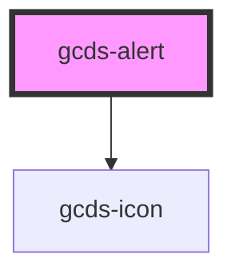

# gcds-alert

<!-- Auto Generated Below -->

## Properties

| Property               | Attribute           | Description                                              | Type                                                | Default     |
| ---------------------- | ------------------- | -------------------------------------------------------- | --------------------------------------------------- | ----------- |
| `alertRole`            | `alert-role`        | Defines alert role.                                      | `"destructive" \| "info" \| "success" \| "warning"` | `'info'`    |
| `dismissHandler`       | --                  | Callback when the close button is clicked.               | `Function`                                          | `undefined` |
| `heading` _(required)_ | `heading`           | Defines the alert heading.                               | `string`                                            | `undefined` |
| `hideCloseBtn`         | `hide-close-btn`    | Defines if the alert's close button is displayed or not. | `boolean`                                           | `false`     |
| `isFixed`              | `is-fixed`          | Defines if the alert's position is fixed.                | `boolean`                                           | `true`      |
| `maxContentWidth`      | `max-content-width` | Defines the max width of the alert content.              | `"fluid" \| "lg" \| "md" \| "sm" \| "xs"`           | `'lg'`      |

## Events

| Event         | Description | Type                |
| ------------- | ----------- | ------------------- |
| `gcdsDismiss` | Events      | `CustomEvent<void>` |

## Dependencies

### Depends on

- [gcds-icon](../gcds-icon)

### Graph

----------------------------------------------

*Built with [StencilJS](https://stenciljs.com/)*
