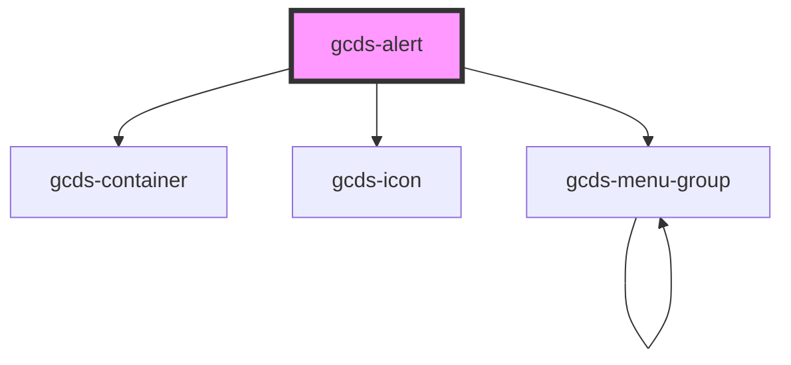

# gcds-alert

<!-- Auto Generated Below -->

## Properties

| Property               | Attribute        | Description                                              | Type                                             | Default     |
| ---------------------- | ---------------- | -------------------------------------------------------- | ------------------------------------------------ | ----------- |
| `alertRole`            | `alert-role`     | Defines alert role.                                      | `"danger" \| "info" \| "success" \| "warning"`   | `'info'`    |
| `container`            | `container`      | Defines the max width of the alert content.              | `"full" \| "lg" \| "md" \| "sm" \| "xl" \| "xs"` | `'full'`    |
| `dismissHandler`       | --               | Callback when the close button is clicked.               | `Function`                                       | `undefined` |
| `heading` _(required)_ | `heading`        | Defines the alert heading.                               | `string`                                         | `undefined` |
| `hideCloseBtn`         | `hide-close-btn` | Defines if the alert's close button is displayed or not. | `boolean`                                        | `false`     |
| `hideRoleIcon`         | `hide-role-icon` | Defines if the alert's role icon is displayed or not.    | `boolean`                                        | `false`     |
| `isFixed`              | `is-fixed`       | Defines if the alert's position is fixed.                | `boolean`                                        | `false`     |

## Events

| Event         | Description | Type                |
| ------------- | ----------- | ------------------- |
| `gcdsDismiss` | Events      | `CustomEvent<void>` |

## Dependencies

### Depends on

- [gcds-container](../gcds-container)
- [gcds-icon](../gcds-icon)
- [gcds-menu-group](../gcds-menu-group)

### Graph

----------------------------------------------

*Built with [StencilJS](https://stenciljs.com/)*
