# gcds-breadcrumbs

<!-- Auto Generated Below -->

## Properties

| Property            | Attribute | Description                                | Type     | Default     |
| ------------------- | --------- | ------------------------------------------ | -------- | ----------- |
| `href` _(required)_ | `href`    | Specifies the href of the breadcrumb item. | `string` | `undefined` |

## Events

| Event       | Description                                                                    | Type                  |
| ----------- | ------------------------------------------------------------------------------ | --------------------- |
| `gcdsBlur`  | Emitted when the link loses focus.                                             | `CustomEvent<void>`   |
| `gcdsClick` | Emitted when the link has been clicked. Contains the href in the event detail. | `CustomEvent<string>` |
| `gcdsFocus` | Emitted when the link has focus.                                               | `CustomEvent<void>`   |

## Slots

| Slot | Description                              |
| ---- | ---------------------------------------- |
|      | Slot for the breadcrumb item link label. |

## Dependencies

### Used by

 - [gcds-breadcrumbs](../gcds-breadcrumbs)

### Depends on

- [gcds-link](../gcds-link)

### Graph

```mermaid
graph TD;
  gcds-breadcrumbs-item --> gcds-link
  gcds-link --> gcds-icon
  gcds-breadcrumbs --> gcds-breadcrumbs-item
  style gcds-breadcrumbs-item fill:#26374a,stroke:#333,stroke-width:4px
```

----------------------------------------------

*Built with [StencilJS](https://stenciljs.com/)*
