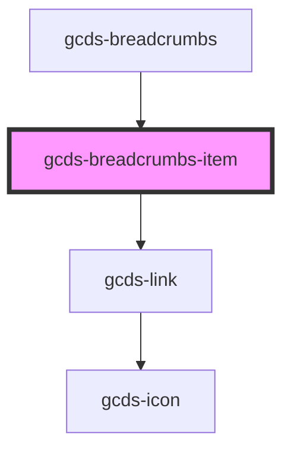

# gcds-breadcrumbs

<!-- Auto Generated Below -->

## Properties

| Property            | Attribute | Description                                | Type     | Default     |
| ------------------- | --------- | ------------------------------------------ | -------- | ----------- |
| `href` _(required)_ | `href`    | Specifies the href of the breadcrumb item. | `string` | `undefined` |

## Dependencies

### Used by

 - [gcds-breadcrumbs](.)

### Depends on

- [gcds-link](../gcds-link)

### Graph

----------------------------------------------

*Built with [StencilJS](https://stenciljs.com/)*
