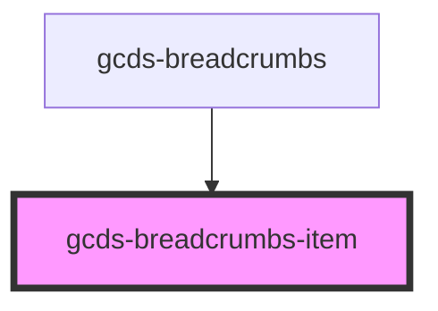

# gcds-breadcrumbs

<!-- Auto Generated Below -->

## Properties

| Property        | Attribute         | Description                                                | Type      | Default     |
| --------------- | ----------------- | ---------------------------------------------------------- | --------- | ----------- |
| `href`          | `href`            | Specifies the href of the breadcrumb item.                 | `string`  | `undefined` |
| `isCurrentPage` | `is-current-page` | Defines if the breadcrumb item is the current page or not. | `boolean` | `false`     |

## Dependencies

### Used by

 - [gcds-breadcrumbs](.)

### Graph

----------------------------------------------

*Built with [StencilJS](https://stenciljs.com/)*
