# gcds-breadcrumbs

<!-- Auto Generated Below -->

## Properties

| Property         | Attribute          | Description                                                    | Type      | Default |
| ---------------- | ------------------ | -------------------------------------------------------------- | --------- | ------- |
| `hideCanadaLink` | `hide-canada-link` | Defines if the default canada.ca link is displayed or omitted. | `boolean` | `false` |

## Slots

| Slot | Description                    |
| ---- | ------------------------------ |
|      | Slot for the breadcrumb items. |

## Dependencies

### Depends on

- [gcds-breadcrumbs-item](../gcds-breadcrumbs-item)

### Graph

```mermaid
graph TD;
  gcds-breadcrumbs --> gcds-breadcrumbs-item
  gcds-breadcrumbs-item --> gcds-link
  gcds-link --> gcds-icon
  style gcds-breadcrumbs fill:#26374a,stroke:#333,stroke-width:4px
```

----------------------------------------------

*Built with [StencilJS](https://stenciljs.com/)*
