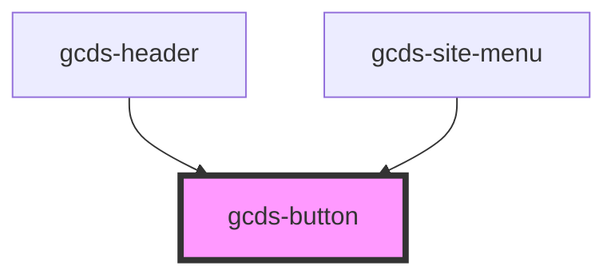

# gcds-button

<!-- Auto Generated Below -->

## Properties

| Property       | Attribute      | Description                                                                                                                                        | Type                                                             | Default     |
| -------------- | -------------- | -------------------------------------------------------------------------------------------------------------------------------------------------- | ---------------------------------------------------------------- | ----------- |
| `blurHandler`  | --             | Custom callback function on blur event                                                                                                             | `Function`                                                       | `undefined` |
| `buttonId`     | `button-id`    | The buttonId attribute specifies the id for a <button> element.                                                                                    | `string`                                                         | `undefined` |
| `buttonRole`   | `button-role`  | Set the main style                                                                                                                                 | `"destructive" \| "primary" \| "secondary" \| "skip-to-content"` | `'primary'` |
| `buttonSize`   | `button-size`  | Set the button size                                                                                                                                | `"regular" \| "small"`                                           | `'regular'` |
| `buttonStyle`  | `button-style` | Set the style variant                                                                                                                              | `"solid" \| "text-only"`                                         | `'solid'`   |
| `buttonType`   | `button-type`  | Set button types                                                                                                                                   | `"button" \| "link" \| "reset" \| "submit"`                      | `'button'`  |
| `clickHandler` | --             | Custom callback function on click event                                                                                                            | `Function`                                                       | `undefined` |
| `disabled`     | `disabled`     | The disabled attribute for a <button> element.                                                                                                     | `boolean`                                                        | `undefined` |
| `download`     | `download`     | The download attribute specifies that the target (the file specified in the href attribute) will be downloaded when a user clicks on the hyperlink | `string`                                                         | `undefined` |
| `focusHandler` | --             | Custom callback function on focus event                                                                                                            | `Function`                                                       | `undefined` |
| `href`         | `href`         | The href attribute specifies the URL of the page the link goes to                                                                                  | `string`                                                         | `undefined` |
| `name`         | `name`         | The name attribute specifies the name for a <button> element.                                                                                      | `string`                                                         | `undefined` |
| `rel`          | `rel`          | The rel attribute specifies the relationship between the current document and the linked document                                                  | `string`                                                         | `undefined` |
| `target`       | `target`       | The target attribute specifies where to open the linked document                                                                                   | `string`                                                         | `undefined` |

## Events

| Event       | Description                          | Type                |
| ----------- | ------------------------------------ | ------------------- |
| `gcdsBlur`  | Emitted when the button loses focus. | `CustomEvent<void>` |
| `gcdsFocus` | Emitted when the button has focus.   | `CustomEvent<void>` |

## Methods

### `focusElement() => Promise<void>`

Focus element

#### Returns

Type: `Promise<void>`

## Dependencies

### Used by

 - [gcds-header](../gcds-header)
 - [gcds-site-menu](../gcds-site-menu)

### Graph

----------------------------------------------

*Built with [StencilJS](https://stenciljs.com/)*
