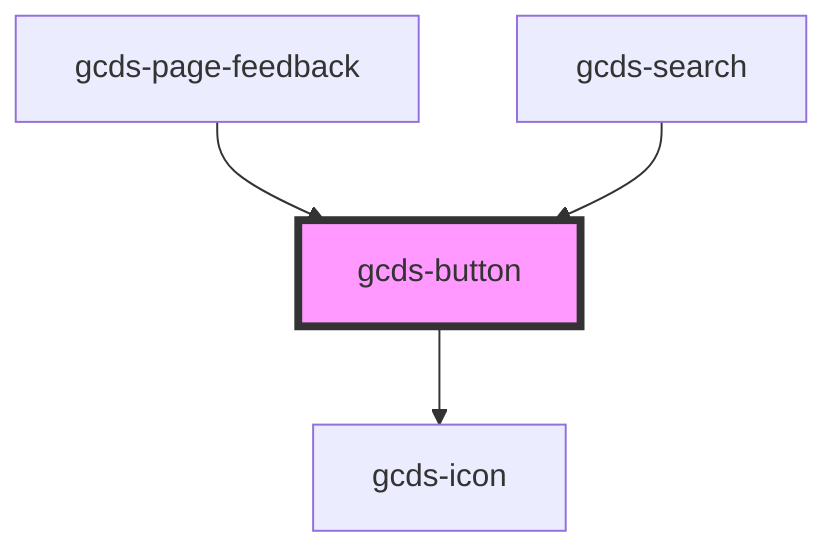

# gcds-button

<!-- Auto Generated Below -->

## Properties

| Property     | Attribute     | Description                                                                                                                                        | Type                                        | Default     |
| ------------ | ------------- | -------------------------------------------------------------------------------------------------------------------------------------------------- | ------------------------------------------- | ----------- |
| `buttonId`   | `button-id`   | The buttonId attribute specifies the id for a <button> element.                                                                                    | `string`                                    | `undefined` |
| `buttonRole` | `button-role` | Set the main style                                                                                                                                 | `"danger" \| "primary" \| "secondary"`      | `'primary'` |
| `disabled`   | `disabled`    | The disabled attribute for a <button> element.                                                                                                     | `boolean`                                   | `undefined` |
| `download`   | `download`    | The download attribute specifies that the target (the file specified in the href attribute) will be downloaded when a user clicks on the hyperlink | `string`                                    | `undefined` |
| `href`       | `href`        | The href attribute specifies the URL of the page the link goes to                                                                                  | `string`                                    | `undefined` |
| `name`       | `name`        | The name attribute specifies the name for a <button> element.                                                                                      | `string`                                    | `undefined` |
| `rel`        | `rel`         | The rel attribute specifies the relationship between the current document and the linked document                                                  | `string`                                    | `undefined` |
| `size`       | `size`        | Set the button size                                                                                                                                | `"regular" \| "small"`                      | `'regular'` |
| `target`     | `target`      | The target attribute specifies where to open the linked document                                                                                   | `string`                                    | `undefined` |
| `type`       | `type`        | Set button types                                                                                                                                   | `"button" \| "link" \| "reset" \| "submit"` | `'button'`  |
| `value`      | `value`       | The value attribute specifies the value for a <button> element.                                                                                    | `string`                                    | `undefined` |

## Events

| Event       | Description                               | Type                |
| ----------- | ----------------------------------------- | ------------------- |
| `gcdsBlur`  | Emitted when the button loses focus.      | `CustomEvent<void>` |
| `gcdsClick` | Emitted when the button has been clicked. | `CustomEvent<void>` |
| `gcdsFocus` | Emitted when the button has focus.        | `CustomEvent<void>` |

## Dependencies

### Used by

 - [gcds-page-feedback](../gcds-page-feedback)
 - [gcds-search](../gcds-search)

### Depends on

- [gcds-icon](../gcds-icon)

### Graph

----------------------------------------------

*Built with [StencilJS](https://stenciljs.com/)*
