# gcds-card

<!-- Auto Generated Below -->

## Overview

A card is a box containing structured, actionable content on a single topic.

## Properties

| Property                 | Attribute        | Description                                                                                                                                                                                                                                            | Type                           | Default     |
| ------------------------ | ---------------- | ------------------------------------------------------------------------------------------------------------------------------------------------------------------------------------------------------------------------------------------------------ | ------------------------------ | ----------- |
| `badge`                  | `badge`          | The badge attribute specifies the badge text that appears in the top left corner of the card. 20 character limit.                                                                                                                                      | `string`                       | `undefined` |
| `cardTitle` _(required)_ | `card-title`     | The card title attribute specifies the title that appears on the card                                                                                                                                                                                  | `string`                       | `undefined` |
| `cardTitleTag`           | `card-title-tag` | The card title tag property specifies the HTML heading element for the title. This property does not modify the font size. It is used to assign the heading level in order to maintain heading hierarchy and accessibility for assistive technologies. | `"h3" \| "h4" \| "h5" \| "h6"` | `undefined` |
| `description`            | `description`    | The description attribute specifies the body of text that appears on the card                                                                                                                                                                          | `string`                       | `undefined` |
| `href` _(required)_      | `href`           | The href attribute specifies the URL of the page the link goes to                                                                                                                                                                                      | `string`                       | `undefined` |
| `imgAlt`                 | `img-alt`        | The img alt attribute specifies the alt text for the image provided, if none, image will be decorative                                                                                                                                                 | `string`                       | `undefined` |
| `imgSrc`                 | `img-src`        | The img src attribute specifies the path to the image                                                                                                                                                                                                  | `string`                       | `undefined` |

## Events

| Event       | Description                                                                    | Type                  |
| ----------- | ------------------------------------------------------------------------------ | --------------------- |
| `gcdsBlur`  | Emitted when the card loses focus.                                             | `CustomEvent<void>`   |
| `gcdsClick` | Emitted when the card has been clicked. Contains the href in the event detail. | `CustomEvent<string>` |
| `gcdsFocus` | Emitted when the card has focus.                                               | `CustomEvent<void>`   |

## Slots

| Slot        | Description                                                                 |
| ----------- | --------------------------------------------------------------------------- |
| `"default"` | Slot for the card description. Will overwrite the description prop if used. |

## Dependencies

### Depends on

- [gcds-text](../gcds-text)
- [gcds-sr-only](../gcds-sr-only)
- [gcds-link](../gcds-link)

### Graph

```mermaid
graph TD;
  gcds-card --> gcds-text
  gcds-card --> gcds-sr-only
  gcds-card --> gcds-link
  gcds-link --> gcds-icon
  style gcds-card fill:#26374a,stroke:#333,stroke-width:4px
```

----------------------------------------------

*Built with [StencilJS](https://stenciljs.com/)*
