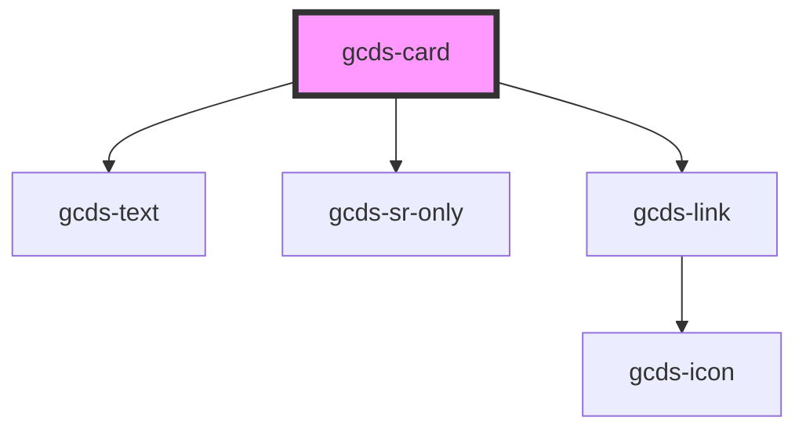

# gcds-card

<!-- Auto Generated Below -->

## Properties

| Property                 | Attribute        | Description                                                                                                       | Type                                  | Default     |
| ------------------------ | ---------------- | ----------------------------------------------------------------------------------------------------------------- | ------------------------------------- | ----------- |
| `badge`                  | `badge`          | The badge attribute specifies the badge text that appears in the top left corner of the card. 20 character limit. | `string`                              | `undefined` |
| `cardTitle` _(required)_ | `card-title`     | The card title attribute specifies the title that appears on the card                                             | `string`                              | `undefined` |
| `cardTitleTag`           | `card-title-tag` | The card title tag attribute specifies HTML element the title renders as                                          | `"a" \| "h3" \| "h4" \| "h5" \| "h6"` | `'a'`       |
| `description`            | `description`    | The description attribute specifies the body of text that appears on the card                                     | `string`                              | `undefined` |
| `href` _(required)_      | `href`           | The href attribute specifies the URL of the page the link goes to                                                 | `string`                              | `undefined` |
| `imgAlt`                 | `img-alt`        | The img alt attribute specifies the alt text for the image provided, if none, image will be decorative            | `string`                              | `undefined` |
| `imgSrc`                 | `img-src`        | The img src attribute specifies the path to the image                                                             | `string`                              | `undefined` |

## Events

| Event       | Description                             | Type                |
| ----------- | --------------------------------------- | ------------------- |
| `gcdsBlur`  | Emitted when the card loses focus.      | `CustomEvent<void>` |
| `gcdsClick` | Emitted when the card has been clicked. | `CustomEvent<void>` |
| `gcdsFocus` | Emitted when the card has focus.        | `CustomEvent<void>` |

## Dependencies

### Depends on

- [gcds-text](../gcds-text)
- [gcds-sr-only](../gcds-sr-only)
- [gcds-link](../gcds-link)

### Graph

----------------------------------------------

*Built with [StencilJS](https://stenciljs.com/)*
