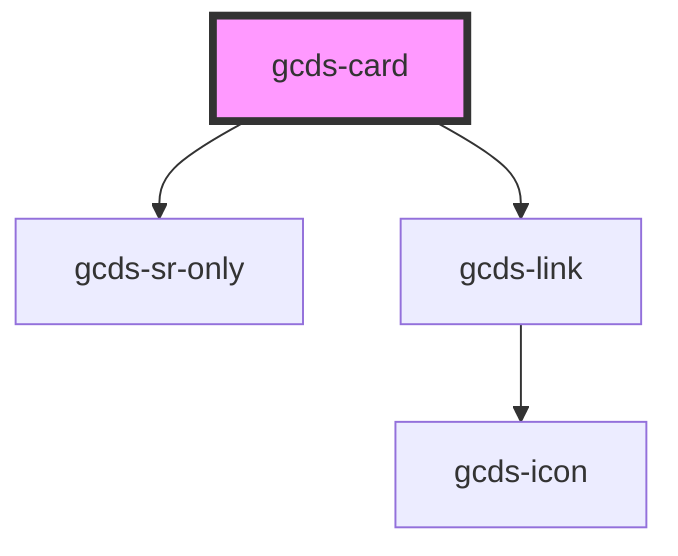

# gcds-card

<!-- Auto Generated Below -->

## Properties

| Property                 | Attribute       | Description                                                                                            | Type                                  | Default     |
| ------------------------ | --------------- | ------------------------------------------------------------------------------------------------------ | ------------------------------------- | ----------- |
| `cardTitle` _(required)_ | `card-title`    | The card title attribute specifies the title that appears on the card                                  | `string`                              | `undefined` |
| `description`            | `description`   | The description attribute specifies the body of text that appears on the card                          | `string`                              | `undefined` |
| `href` _(required)_      | `href`          | The href attribute specifies the URL of the page the link goes to                                      | `string`                              | `undefined` |
| `imgAlt`                 | `img-alt`       | The img alt attribute specifies the alt text for the image provided, if none, image will be decorative | `string`                              | `undefined` |
| `imgSrc`                 | `img-src`       | The img src attribute specifies the path to the image                                                  | `string`                              | `undefined` |
| `tag`                    | `tag`           | The tag attribute specifies the tag text that appears above the card title                             | `string`                              | `undefined` |
| `titleElement`           | `title-element` | The title element attribute specifies HTML element the title renders as                                | `"a" \| "h3" \| "h4" \| "h5" \| "h6"` | `'a'`       |
| `type`                   | `type`          | The type attribute specifies how the card renders as a link                                            | `"action" \| "link"`                  | `'link'`    |

## Dependencies

### Depends on

- [gcds-sr-only](../gcds-sr-only)
- [gcds-link](../gcds-link)

### Graph

----------------------------------------------

*Built with [StencilJS](https://stenciljs.com/)*
