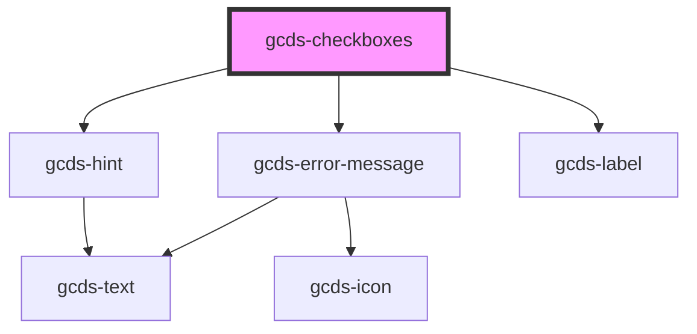

# gcds-checkbox

<!-- Auto Generated Below -->

## Properties

| Property               | Attribute       | Description                                                        | Type                                                | Default     |
| ---------------------- | --------------- | ------------------------------------------------------------------ | --------------------------------------------------- | ----------- |
| `disabled`             | `disabled`      | Specifies if the checkboxes are disabled or not.                   | `boolean`                                           | `undefined` |
| `errorMessage`         | `error-message` | Set this to display an error message for invalid <gcds-checkboxes> | `string`                                            | `undefined` |
| `hint`                 | `hint`          | Hint displayed below the label.                                    | `string`                                            | `undefined` |
| `legend`               | `legend`        | Set the legend for fieldset form group.                            | `string`                                            | `undefined` |
| `name` _(required)_    | `name`          | Name attribute for a checkboxes element.                           | `string`                                            | `undefined` |
| `options` _(required)_ | `options`       | Options to render checkboxes buttons                               | `CheckboxObject[] \| string`                        | `undefined` |
| `required`             | `required`      | Specifies if the checkboxes are required or not.                   | `boolean`                                           | `undefined` |
| `validateOn`           | `validate-on`   | Set event to call validator                                        | `"blur" \| "other" \| "submit"`                     | `undefined` |
| `validator`            | --              | Array of validators                                                | `(string \| ValidatorEntry \| Validator<string>)[]` | `undefined` |
| `value`                | `value`         | Value for checkboxes component.                                    | `string \| string[]`                                | `[]`        |

## Events

| Event       | Description                                    | Type                  |
| ----------- | ---------------------------------------------- | --------------------- |
| `gcdsBlur`  | Emitted when the checkbox loses focus.         | `CustomEvent<void>`   |
| `gcdsClick` | Emitted when the checkbox has been clicked.    | `CustomEvent<void>`   |
| `gcdsError` | Emitted when the input has a validation error. | `CustomEvent<object>` |
| `gcdsFocus` | Emitted when the checkbox has focus.           | `CustomEvent<void>`   |
| `gcdsInput` | Emmitted when a checkbox has been inputted.    | `CustomEvent<any>`    |
| `gcdsValid` | Emitted when the input has a validation error. | `CustomEvent<object>` |

## Methods

### `validate() => Promise<void>`

Call any active validators

#### Returns

Type: `Promise<void>`

## Dependencies

### Depends on

- [gcds-hint](../gcds-hint)
- [gcds-error-message](../gcds-error-message)
- [gcds-label](../gcds-label)

### Graph

----------------------------------------------

*Built with [StencilJS](https://stenciljs.com/)*
