# gcds-checkbox

<!-- Auto Generated Below -->

## Overview

Checkboxes provide a set of options for multiple responses.

## Properties

| Property               | Attribute       | Description                                                                                                                  | Type                                                | Default     |
| ---------------------- | --------------- | ---------------------------------------------------------------------------------------------------------------------------- | --------------------------------------------------- | ----------- |
| `autofocus`            | `autofocus`     | If true, the checkobox will be focused on component render                                                                   | `boolean`                                           | `undefined` |
| `disabled`             | `disabled`      | Specifies if the checkboxes are disabled or not.                                                                             | `boolean`                                           | `undefined` |
| `errorMessage`         | `error-message` | Set this to display an error message for invalid <gcds-checkboxes>                                                           | `string`                                            | `undefined` |
| `form`                 | `form`          | The ID of the form that the checkboxes belong to.                                                                            | `string`                                            | `undefined` |
| `hideLabel`            | `hide-label`    | For single checkbox, specifies if the label is hidden or not.                                                                | `boolean`                                           | `false`     |
| `hideLegend`           | `hide-legend`   | For checkbox groups, specifies if the legend is hidden or not.                                                               | `boolean`                                           | `false`     |
| `hint`                 | `hint`          | Hint displayed below the label.                                                                                              | `string`                                            | `undefined` |
| `legend`               | `legend`        | Set the legend for fieldset form group.                                                                                      | `string`                                            | `undefined` |
| `name` _(required)_    | `name`          | Name attribute for a checkboxes element.                                                                                     | `string`                                            | `undefined` |
| `options` _(required)_ | `options`       | Options to render checkboxes buttons                                                                                         | `CheckboxObject[] \| string`                        | `undefined` |
| `required`             | `required`      | Specifies if the checkboxes are required or not.                                                                             | `boolean`                                           | `undefined` |
| `validateOn`           | `validate-on`   | Set event to call validator                                                                                                  | `"blur" \| "other" \| "submit"`                     | `'blur'`    |
| `validator`            | `validator`     | Array of validators                                                                                                          | `(string \| ValidatorEntry \| Validator<string>)[]` | `undefined` |
| `validity`             | `validity`      | Read-only property of the checkboxes, returns a ValidityState object that represents the validity states this element is in. | `ValidityState`                                     | `undefined` |
| `value`                | `value`         | Value for checkboxes component.                                                                                              | `string \| string[]`                                | `[]`        |

## Events

| Event        | Description                                                                            | Type                    |
| ------------ | -------------------------------------------------------------------------------------- | ----------------------- |
| `gcdsBlur`   | Emitted when the checkbox loses focus.                                                 | `CustomEvent<void>`     |
| `gcdsChange` | Emitted when a checkbox has been changed. Contains the new value in the event detail.  | `CustomEvent<string[]>` |
| `gcdsClick`  | Emitted when the checkbox has been clicked.                                            | `CustomEvent<void>`     |
| `gcdsError`  | Emitted when the checkbox has a validation error.                                      | `CustomEvent<object>`   |
| `gcdsFocus`  | Emitted when the checkbox has focus.                                                   | `CustomEvent<void>`     |
| `gcdsInput`  | Emitted when a checkbox has been inputted. Contains the new value in the event detail. | `CustomEvent<string[]>` |
| `gcdsValid`  | Emitted when the checkbox has a validation error.                                      | `CustomEvent<object>`   |

## Methods

### `checkValidity() => Promise<boolean>`

Check the validity of gcds-checkboxes

#### Returns

Type: `Promise<boolean>`

### `getValidationMessage() => Promise<string>`

Get validationMessage of gcds-checkboxes

#### Returns

Type: `Promise<string>`

### `validate() => Promise<void>`

Call any active validators

#### Returns

Type: `Promise<void>`

## Dependencies

### Depends on

- [gcds-sr-only](../gcds-sr-only)
- [gcds-hint](../gcds-hint)
- [gcds-error-message](../gcds-error-message)
- [gcds-label](../gcds-label)

### Graph

```mermaid
graph TD;
  gcds-checkboxes --> gcds-sr-only
  gcds-checkboxes --> gcds-hint
  gcds-checkboxes --> gcds-error-message
  gcds-checkboxes --> gcds-label
  gcds-hint --> gcds-text
  gcds-error-message --> gcds-text
  gcds-error-message --> gcds-icon
  style gcds-checkboxes fill:#26374a,stroke:#333,stroke-width:4px
```

----------------------------------------------

*Built with [StencilJS](https://stenciljs.com/)*
