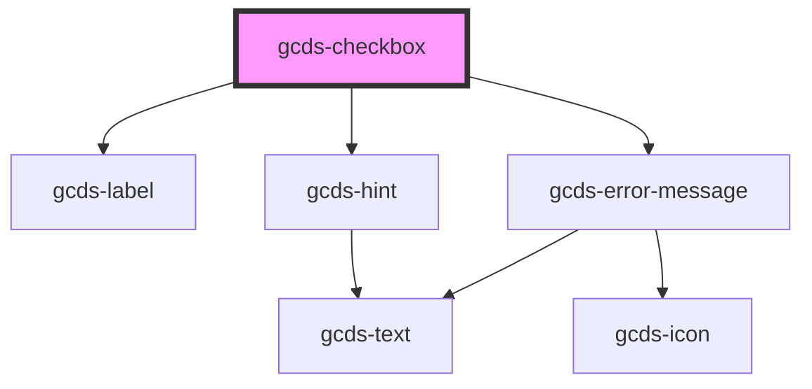

# gcds-checkbox

<!-- Auto Generated Below -->

## Properties

| Property                  | Attribute       | Description                                       | Type                                                | Default     |
| ------------------------- | --------------- | ------------------------------------------------- | --------------------------------------------------- | ----------- |
| `checkboxId` _(required)_ | `checkbox-id`   | Id attribute for an input element.                | `string`                                            | `undefined` |
| `checked`                 | `checked`       | Specifies if an input element is checked.         | `boolean`                                           | `undefined` |
| `disabled`                | `disabled`      | Specifies if an input element is disabled or not. | `boolean`                                           | `undefined` |
| `errorMessage`            | `error-message` | Error message for an invalid input element.       | `string`                                            | `undefined` |
| `hint`                    | `hint`          | Hint displayed below the label.                   | `string`                                            | `undefined` |
| `label` _(required)_      | `label`         | Form field label                                  | `string`                                            | `undefined` |
| `name` _(required)_       | `name`          | Name attribute for an input element.              | `string`                                            | `undefined` |
| `required`                | `required`      | Specifies if a form field is required or not.     | `boolean`                                           | `undefined` |
| `validateOn`              | `validate-on`   | Set event to call validator                       | `"blur" \| "other" \| "submit"`                     | `undefined` |
| `validator`               | --              | Array of validators                               | `(string \| ValidatorEntry \| Validator<string>)[]` | `undefined` |
| `value`                   | `value`         | Value for an input element.                       | `string`                                            | `undefined` |

## Events

| Event        | Description                                    | Type                  |
| ------------ | ---------------------------------------------- | --------------------- |
| `gcdsBlur`   | Emitted when the checkbox loses focus.         | `CustomEvent<void>`   |
| `gcdsChange` | Update value based on user input.              | `CustomEvent<any>`    |
| `gcdsClick`  | Emitted when the checkbox has been clicked.    | `CustomEvent<void>`   |
| `gcdsError`  | Emitted when the input has a validation error. | `CustomEvent<object>` |
| `gcdsFocus`  | Emitted when the checkbox has focus.           | `CustomEvent<void>`   |
| `gcdsValid`  | Emitted when the input has a validation error. | `CustomEvent<object>` |

## Methods

### `validate() => Promise<void>`

Call any active validators

#### Returns

Type: `Promise<void>`

## Dependencies

### Depends on

- [gcds-label](../gcds-label)
- [gcds-hint](../gcds-hint)
- [gcds-error-message](../gcds-error-message)

### Graph

----------------------------------------------

*Built with [StencilJS](https://stenciljs.com/)*
