# gcds-container

<!-- Auto Generated Below -->

## Overview

A container is a basic box layout with a set width for its contents.

## Properties

| Property  | Attribute | Description                                                                                                                                                                                                                                                                                                                          | Type                                                                                                                                                                                                                                                                                   | Default     |
| --------- | --------- | ------------------------------------------------------------------------------------------------------------------------------------------------------------------------------------------------------------------------------------------------------------------------------------------------------------------------------------ | -------------------------------------------------------------------------------------------------------------------------------------------------------------------------------------------------------------------------------------------------------------------------------------- | ----------- |
| `align`   | `align`   | Defines the container's alignment. This property is ignored when `layout` is set to `page`, as the page layout has higher priority.                                                                                                                                                                                                  | `"center" \| "end" \| "start"`                                                                                                                                                                                                                                                         | `undefined` |
| `border`  | `border`  | Defines if the container has a border.                                                                                                                                                                                                                                                                                               | `boolean`                                                                                                                                                                                                                                                                              | `false`     |
| `layout`  | `layout`  | Controls how the container aligns with the page layout. When set to `page`, the container uses a max width of 1140px and switches to 90% width on smaller screens to scale consistently with core page layout components such as the header and footer. When set to `full`, the container spans the full width (100%) of its parent. | `"full" \| "page"`                                                                                                                                                                                                                                                                     | `undefined` |
| `margin`  | `margin`  | Container margin. Horizontal margins (left and right) are not applied if the container’s align property is defined, since alignment has higher priority.                                                                                                                                                                             | `"0" \| "25" \| "50" \| "75" \| "100" \| "125" \| "150" \| "175" \| "200" \| "225" \| "250" \| "300" \| "350" \| "400" \| "450" \| "500" \| "550" \| "600" \| "650" \| "700" \| "750" \| "800" \| "850" \| "900" \| "950" \| "1000" \| "1050" \| "1100" \| "1150" \| "1200" \| "1250"` | `undefined` |
| `padding` | `padding` | Defines the container's padding.                                                                                                                                                                                                                                                                                                     | `"0" \| "25" \| "50" \| "75" \| "100" \| "125" \| "150" \| "175" \| "200" \| "225" \| "250" \| "300" \| "350" \| "400" \| "450" \| "500" \| "550" \| "600" \| "650" \| "700" \| "750" \| "800" \| "850" \| "900" \| "950" \| "1000" \| "1050" \| "1100" \| "1150" \| "1200" \| "1250"` | `undefined` |
| `size`    | `size`    | Defines container size.                                                                                                                                                                                                                                                                                                              | `"full" \| "lg" \| "md" \| "sm" \| "xl" \| "xs"`                                                                                                                                                                                                                                       | `'full'`    |
| `tag`     | `tag`     | Set tag for container.                                                                                                                                                                                                                                                                                                               | `string`                                                                                                                                                                                                                                                                               | `'div'`     |

## Slots

| Slot        | Description                                 |
| ----------- | ------------------------------------------- |
| `"default"` | Slot for the main content of the container. |

## Dependencies

### Used by

 - [gcds-alert](../gcds-alert)
 - [gcds-grid](../gcds-grid)

### Graph

```mermaid
graph TD;
  gcds-alert --> gcds-container
  gcds-grid --> gcds-container
  style gcds-container fill:#26374a,stroke:#333,stroke-width:4px
```

----------------------------------------------

*Built with [StencilJS](https://stenciljs.com/)*
