# gcds-container

<!-- Auto Generated Below -->

## Properties

| Property        | Attribute        | Description                                                                                                                                                                                                       | Type                                                                                                                                                                                                                                                                                   | Default     |
| --------------- | ---------------- | ----------------------------------------------------------------------------------------------------------------------------------------------------------------------------------------------------------------- | -------------------------------------------------------------------------------------------------------------------------------------------------------------------------------------------------------------------------------------------------------------------------------------- | ----------- |
| `border`        | `border`         | Defines if the container has a border.                                                                                                                                                                            | `boolean`                                                                                                                                                                                                                                                                              | `false`     |
| `centered`      | `centered`       | Defines if the container is centered.                                                                                                                                                                             | `boolean`                                                                                                                                                                                                                                                                              | `false`     |
| `mainContainer` | `main-container` | Defines if the container is the main page container. When true, the width will be set to 90% for smaller screens to ensure consistency with the responsiveness of other core layout components (header + footer). | `boolean`                                                                                                                                                                                                                                                                              | `false`     |
| `margin`        | `margin`         | Container margin. Left and right margins won't be applied if the container is centered.                                                                                                                           | `"0" \| "25" \| "50" \| "75" \| "100" \| "125" \| "150" \| "175" \| "200" \| "225" \| "250" \| "300" \| "350" \| "400" \| "450" \| "500" \| "550" \| "600" \| "650" \| "700" \| "750" \| "800" \| "850" \| "900" \| "950" \| "1000" \| "1050" \| "1100" \| "1150" \| "1200" \| "1250"` | `undefined` |
| `padding`       | `padding`        | Defines the container's padding.                                                                                                                                                                                  | `"0" \| "25" \| "50" \| "75" \| "100" \| "125" \| "150" \| "175" \| "200" \| "225" \| "250" \| "300" \| "350" \| "400" \| "450" \| "500" \| "550" \| "600" \| "650" \| "700" \| "750" \| "800" \| "850" \| "900" \| "950" \| "1000" \| "1050" \| "1100" \| "1150" \| "1200" \| "1250"` | `undefined` |
| `size`          | `size`           | Defines container size.                                                                                                                                                                                           | `"full" \| "lg" \| "md" \| "sm" \| "xl" \| "xs"`                                                                                                                                                                                                                                       | `'full'`    |
| `tag`           | `tag`            | Set tag for container.                                                                                                                                                                                            | `string`                                                                                                                                                                                                                                                                               | `'div'`     |

## Slots

| Slot | Description                                 |
| ---- | ------------------------------------------- |
|      | Slot for the main content of the container. |

## Dependencies

### Used by

 - [gcds-alert](../gcds-alert)
 - [gcds-grid](../gcds-grid)
 - [gcds-phase-banner](../gcds-phase-banner)

### Graph

```mermaid
graph TD;
  gcds-alert --> gcds-container
  gcds-grid --> gcds-container
  gcds-phase-banner --> gcds-container
  style gcds-container fill:#26374a,stroke:#333,stroke-width:4px
```

----------------------------------------------

*Built with [StencilJS](https://stenciljs.com/)*
