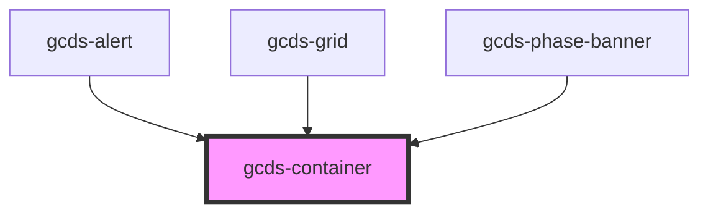

# gcds-container

<!-- Auto Generated Below -->

## Properties

| Property        | Attribute        | Description                                                                                                                                                                                                                   | Type                                                                                                                                         | Default     |
| --------------- | ---------------- | ----------------------------------------------------------------------------------------------------------------------------------------------------------------------------------------------------------------------------- | -------------------------------------------------------------------------------------------------------------------------------------------- | ----------- |
| `border`        | `border`         | Defines if container has a border or not.                                                                                                                                                                                     | `boolean`                                                                                                                                    | `false`     |
| `centered`      | `centered`       | Defines if container is centered or not.                                                                                                                                                                                      | `boolean`                                                                                                                                    | `false`     |
| `mainContainer` | `main-container` | Defines if the container is the main page container or not. If set to true, the width will be set to 90% for smaller screens to ensure consistency with the responsiveness of other core layout components (header + footer). | `boolean`                                                                                                                                    | `false`     |
| `margin`        | `margin`         | Defines the container's margin. Note that left and right margin will not be applied if the container is centered.                                                                                                             | `"0" \| "100" \| "1000" \| "150" \| "200" \| "250" \| "300" \| "400" \| "450" \| "50" \| "500" \| "550" \| "600" \| "700" \| "800" \| "900"` | `undefined` |
| `padding`       | `padding`        | Defines the container's padding.                                                                                                                                                                                              | `"0" \| "100" \| "1000" \| "150" \| "200" \| "250" \| "300" \| "400" \| "450" \| "50" \| "500" \| "550" \| "600" \| "700" \| "800" \| "900"` | `undefined` |
| `size`          | `size`           | Defines container size.                                                                                                                                                                                                       | `"full" \| "lg" \| "md" \| "sm" \| "xl" \| "xs"`                                                                                             | `'full'`    |
| `tag`           | `tag`            | Set tag for container.                                                                                                                                                                                                        | `string`                                                                                                                                     | `'div'`     |

## Dependencies

### Used by

 - [gcds-alert](../gcds-alert)
 - [gcds-grid](../gcds-grid)
 - [gcds-phase-banner](../gcds-phase-banner)

### Graph

----------------------------------------------

*Built with [StencilJS](https://stenciljs.com/)*
