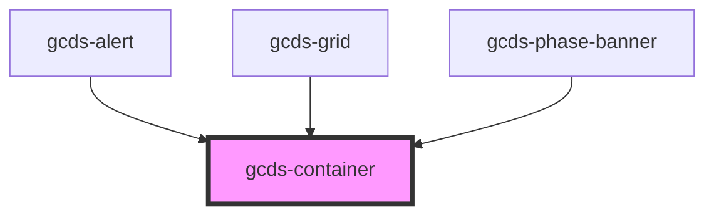

# gcds-container

<!-- Auto Generated Below -->

## Properties

| Property    | Attribute   | Description                             | Type                                             | Default  |
| ----------- | ----------- | --------------------------------------- | ------------------------------------------------ | -------- |
| `centered`  | `centered`  | Defines if container is centered or not | `boolean`                                        | `false`  |
| `container` | `container` | Defines container size                  | `"full" \| "lg" \| "md" \| "sm" \| "xl" \| "xs"` | `'full'` |
| `tag`       | `tag`       | Set tag for container                   | `string`                                         | `'div'`  |

## Dependencies

### Used by

 - [gcds-alert](../gcds-alert)
 - [gcds-grid](../gcds-grid)
 - [gcds-phase-banner](../gcds-phase-banner)

### Graph

----------------------------------------------

*Built with [StencilJS](https://stenciljs.com/)*
