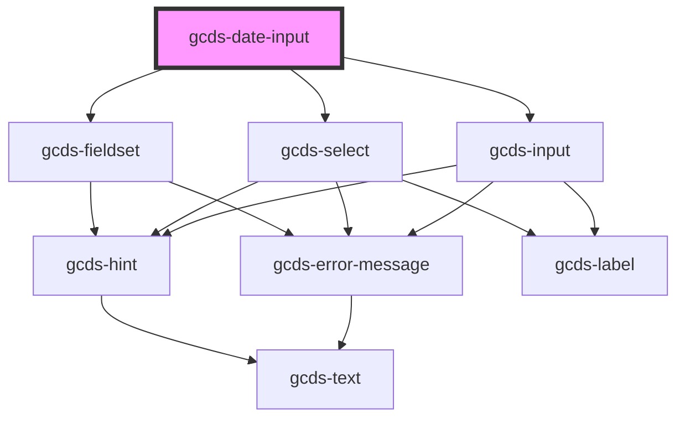

# gcds-date-input

<!-- Auto Generated Below -->

## Properties

| Property             | Attribute       | Description                                                     | Type      | Default     |
| -------------------- | --------------- | --------------------------------------------------------------- | --------- | ----------- |
| `disabled`           | `disabled`      | Specifies if the date input is disabled or not.                 | `boolean` | `false`     |
| `errorMessage`       | `error-message` | Error message displayed below the legend and above form fields. | `string`  | `undefined` |
| `hint`               | `hint`          | Hint displayed below the legend and above form fields.          | `string`  | `undefined` |
| `label` _(required)_ | `label`         | Form field label                                                | `string`  | `undefined` |
| `name` _(required)_  | `name`          | Name attribute for the date input.                              | `string`  | `undefined` |
| `required`           | `required`      | Specifies if a form field is required or not.                   | `boolean` | `false`     |

## Dependencies

### Depends on

- [gcds-fieldset](../gcds-fieldset)
- [gcds-select](../gcds-select)
- [gcds-input](../gcds-input)

### Graph

----------------------------------------------

*Built with [StencilJS](https://stenciljs.com/)*
