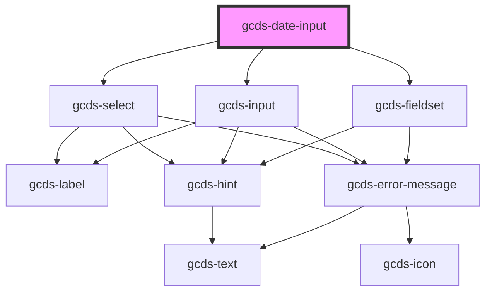

# gcds-date-input

<!-- Auto Generated Below -->

## Properties

| Property              | Attribute       | Description                                                                                                                            | Type                                                | Default     |
| --------------------- | --------------- | -------------------------------------------------------------------------------------------------------------------------------------- | --------------------------------------------------- | ----------- |
| `disabled`            | `disabled`      | Specifies if the date input is disabled or not.                                                                                        | `boolean`                                           | `false`     |
| `errorMessage`        | `error-message` | Error message displayed below the legend and above form fields.                                                                        | `string`                                            | `undefined` |
| `format` _(required)_ | `format`        | Set this property to full to show month, day, and year form elements. Set it to compact to show only the month and year form elements. | `"compact" \| "full"`                               | `undefined` |
| `hint`                | `hint`          | Hint displayed below the legend and above form fields.                                                                                 | `string`                                            | `undefined` |
| `legend` _(required)_ | `legend`        | Fieldset legend                                                                                                                        | `string`                                            | `undefined` |
| `name` _(required)_   | `name`          | Name attribute for the date input.                                                                                                     | `string`                                            | `undefined` |
| `required`            | `required`      | Specifies if a form field is required or not.                                                                                          | `boolean`                                           | `false`     |
| `validateOn`          | `validate-on`   | Set event to call validator                                                                                                            | `"blur" \| "other" \| "submit"`                     | `undefined` |
| `validator`           | --              | Array of validators                                                                                                                    | `(string \| ValidatorEntry \| Validator<string>)[]` | `undefined` |
| `value`               | `value`         | Default value for the date input element. Format: YYYY-MM-DD                                                                           | `string`                                            | `undefined` |

## Events

| Event        | Description                                     | Type                  |
| ------------ | ----------------------------------------------- | --------------------- |
| `gcdsBlur`   | Emitted when an element loses focus.            | `CustomEvent<void>`   |
| `gcdsChange` | Emitted when an element has changed.            | `CustomEvent<any>`    |
| `gcdsError`  | Emitted when an element has a validation error. | `CustomEvent<object>` |
| `gcdsFocus`  | Emitted when an element has focus.              | `CustomEvent<void>`   |
| `gcdsInput`  | Emitted when the element has received input.    | `CustomEvent<any>`    |
| `gcdsValid`  | Emitted when an element has validated.          | `CustomEvent<object>` |

## Methods

### `validate() => Promise<void>`

Call any active validators

#### Returns

Type: `Promise<void>`

## Dependencies

### Depends on

- [gcds-select](../gcds-select)
- [gcds-input](../gcds-input)
- [gcds-fieldset](../gcds-fieldset)

### Graph

----------------------------------------------

*Built with [StencilJS](https://stenciljs.com/)*
