# gcds-date-input

<!-- Auto Generated Below -->

## Overview

A date input is a space to enter a known date.

## Properties

| Property              | Attribute       | Description                                                                                                                            | Type                                                | Default     |
| --------------------- | --------------- | -------------------------------------------------------------------------------------------------------------------------------------- | --------------------------------------------------- | ----------- |
| `autofocus`           | `autofocus`     | If true, the date-input will be focused on component render                                                                            | `boolean`                                           | `undefined` |
| `disabled`            | `disabled`      | Specifies if the date input is disabled or not.                                                                                        | `boolean`                                           | `false`     |
| `errorMessage`        | `error-message` | Error message displayed below the legend and above form fields.                                                                        | `string`                                            | `undefined` |
| `format` _(required)_ | `format`        | Set this property to full to show month, day, and year form elements. Set it to compact to show only the month and year form elements. | `"compact" \| "full"`                               | `undefined` |
| `hint`                | `hint`          | Hint displayed below the legend and above form fields.                                                                                 | `string`                                            | `undefined` |
| `legend` _(required)_ | `legend`        | Fieldset legend                                                                                                                        | `string`                                            | `undefined` |
| `max`                 | `max`           | The maximum date that the date-input field can accept. Format: YYYY-MM-DD or YYYY-MM                                                   | `string`                                            | `undefined` |
| `min`                 | `min`           | The minimum date that the date-input field can accept. Format: YYYY-MM-DD or YYYY-MM                                                   | `string`                                            | `undefined` |
| `name` _(required)_   | `name`          | Name attribute for the date input.                                                                                                     | `string`                                            | `undefined` |
| `required`            | `required`      | Specifies if a form field is required or not.                                                                                          | `boolean`                                           | `false`     |
| `validateOn`          | `validate-on`   | Set event to call validator                                                                                                            | `"blur" \| "other" \| "submit"`                     | `'blur'`    |
| `validator`           | `validator`     | Array of validators                                                                                                                    | `(string \| ValidatorEntry \| Validator<string>)[]` | `undefined` |
| `validity`            | `validity`      | Read-only property of the date-input, returns a ValidityState object that represents the validity states this element is in.           | `ValidityState`                                     | `undefined` |
| `value`               | `value`         | Combined date value from the two/three form elements. Format: YYYY-MM-DD or YYYY-MM                                                    | `string`                                            | `undefined` |

## Events

| Event        | Description                                                                                 | Type                  |
| ------------ | ------------------------------------------------------------------------------------------- | --------------------- |
| `gcdsBlur`   | Emitted when a date-input loses focus.                                                      | `CustomEvent<void>`   |
| `gcdsChange` | Emitted when a date-input has changed. Contains the new value in the event detail.          | `CustomEvent<string>` |
| `gcdsError`  | Emitted when a date-input has a validation error.                                           | `CustomEvent<object>` |
| `gcdsFocus`  | Emitted when a date-input has focus.                                                        | `CustomEvent<void>`   |
| `gcdsInput`  | Emitted when the date-input has received input. Contains the new value in the event detail. | `CustomEvent<string>` |
| `gcdsValid`  | Emitted when a date-input has validated.                                                    | `CustomEvent<object>` |

## Methods

### `checkValidity() => Promise<boolean>`

Check the validity of gcds-date-input

#### Returns

Type: `Promise<boolean>`

### `getValidationMessage() => Promise<string>`

Get validationMessage of gcds-date-input

#### Returns

Type: `Promise<string>`

### `validate() => Promise<void>`

Call any active validators

#### Returns

Type: `Promise<void>`

## Dependencies

### Depends on

- [gcds-select](../gcds-select)
- [gcds-input](../gcds-input)
- [gcds-hint](../gcds-hint)
- [gcds-error-message](../gcds-error-message)

### Graph

```mermaid
graph TD;
  gcds-date-input --> gcds-select
  gcds-date-input --> gcds-input
  gcds-date-input --> gcds-hint
  gcds-date-input --> gcds-error-message
  gcds-select --> gcds-label
  gcds-select --> gcds-hint
  gcds-select --> gcds-error-message
  gcds-hint --> gcds-text
  gcds-error-message --> gcds-text
  gcds-error-message --> gcds-icon
  gcds-input --> gcds-label
  gcds-input --> gcds-hint
  gcds-input --> gcds-error-message
  style gcds-date-input fill:#26374a,stroke:#333,stroke-width:4px
```

----------------------------------------------

*Built with [StencilJS](https://stenciljs.com/)*
