# gcds-date-modified

<!-- Auto Generated Below -->

## Overview

Date modified is an indicator of the last update to a webpage or application.

## Properties

| Property | Attribute | Description                              | Type                  | Default  |
| -------- | --------- | ---------------------------------------- | --------------------- | -------- |
| `type`   | `type`    | Set date modified type. Default is date. | `"date" \| "version"` | `'date'` |

## Slots

| Slot        | Description                       |
| ----------- | --------------------------------- |
| `"default"` | Slot for the date/version number. |

## Dependencies

### Depends on

- [gcds-text](../gcds-text)

### Graph

```mermaid
graph TD;
  gcds-date-modified --> gcds-text
  style gcds-date-modified fill:#26374a,stroke:#333,stroke-width:4px
```

----------------------------------------------

*Built with [StencilJS](https://stenciljs.com/)*
