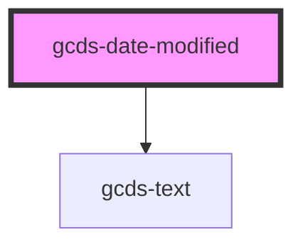

# gcds-date-modified

<!-- Auto Generated Below -->

## Properties

| Property | Attribute | Description                              | Type                  | Default  |
| -------- | --------- | ---------------------------------------- | --------------------- | -------- |
| `type`   | `type`    | Set date modified type. Default is date. | `"date" \| "version"` | `'date'` |

## Dependencies

### Depends on

- [gcds-text](../gcds-text)

### Graph

----------------------------------------------

*Built with [StencilJS](https://stenciljs.com/)*
