# gcds-error-message

<!-- Auto Generated Below -->

## Overview

An error message is a description of a problem blocking a user goal.

## Properties

| Property                 | Attribute    | Description                         | Type     | Default     |
| ------------------------ | ------------ | ----------------------------------- | -------- | ----------- |
| `messageId` _(required)_ | `message-id` | Id attribute for the error message. | `string` | `undefined` |

## Slots

| Slot | Description                         |
| ---- | ----------------------------------- |
|      | Slot for the error message content. |

## Dependencies

### Used by

 - [gcds-checkboxes](../gcds-checkboxes)
 - [gcds-date-input](../gcds-date-input)
 - [gcds-file-uploader](../gcds-file-uploader)
 - [gcds-input](../gcds-input)
 - [gcds-radios](../gcds-radios)
 - [gcds-select](../gcds-select)
 - [gcds-textarea](../gcds-textarea)

### Depends on

- [gcds-text](../gcds-text)
- [gcds-icon](../gcds-icon)

### Graph

```mermaid
graph TD;
  gcds-error-message --> gcds-text
  gcds-error-message --> gcds-icon
  gcds-checkboxes --> gcds-error-message
  gcds-date-input --> gcds-error-message
  gcds-file-uploader --> gcds-error-message
  gcds-input --> gcds-error-message
  gcds-radios --> gcds-error-message
  gcds-select --> gcds-error-message
  gcds-textarea --> gcds-error-message
  style gcds-error-message fill:#26374a,stroke:#333,stroke-width:4px
```

----------------------------------------------

*Built with [StencilJS](https://stenciljs.com/)*
