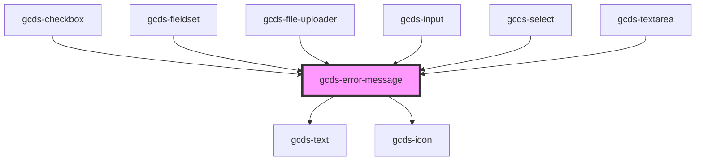

# gcds-error-message

<!-- Auto Generated Below -->

## Properties

| Property                 | Attribute    | Description                         | Type     | Default     |
| ------------------------ | ------------ | ----------------------------------- | -------- | ----------- |
| `messageId` _(required)_ | `message-id` | Id attribute for the error message. | `string` | `undefined` |

## Dependencies

### Used by

 - [gcds-checkbox](../gcds-checkbox)
 - [gcds-fieldset](../gcds-fieldset)
 - [gcds-file-uploader](../gcds-file-uploader)
 - [gcds-input](../gcds-input)
 - [gcds-select](../gcds-select)
 - [gcds-textarea](../gcds-textarea)

### Depends on

- [gcds-text](../gcds-text)
- [gcds-icon](../gcds-icon)

### Graph

----------------------------------------------

*Built with [StencilJS](https://stenciljs.com/)*
