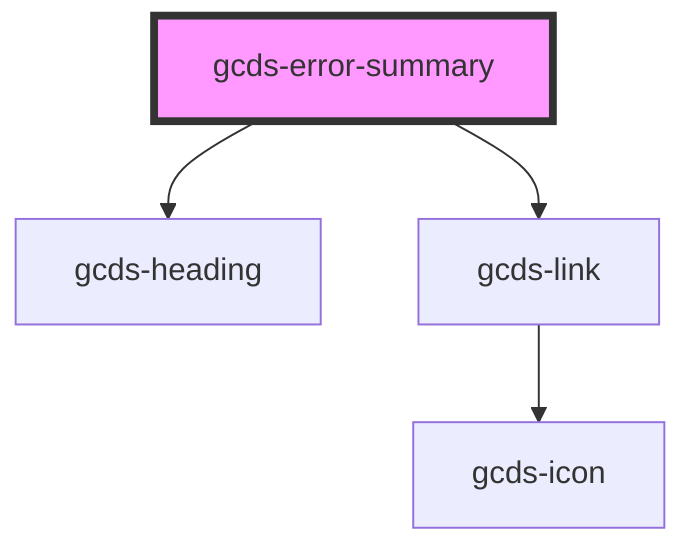

# gcds-error-summary

<!-- Auto Generated Below -->

## Properties

| Property     | Attribute     | Description                                                                              | Type               | Default     |
| ------------ | ------------- | ---------------------------------------------------------------------------------------- | ------------------ | ----------- |
| `errorLinks` | `error-links` | Object of list items for error list. Format: { link-href: link-label }                   | `object \| string` | `undefined` |
| `heading`    | `heading`     | Set error summary heading                                                                | `string`           | `undefined` |
| `listen`     | `listen`      | Specifies if the error summary should listen for GcdsError event to generate error list. | `boolean`          | `true`      |

## Dependencies

### Depends on

- [gcds-heading](../gcds-heading)
- [gcds-link](../gcds-link)

### Graph

----------------------------------------------

*Built with [StencilJS](https://stenciljs.com/)*
