# gcds-fieldset

<!-- Auto Generated Below -->

## Properties

| Property                  | Attribute     | Description                                             | Type                                   | Default     |
| ------------------------- | ------------- | ------------------------------------------------------- | -------------------------------------- | ----------- |
| `hint`                    | `hint`        | Hint displayed below the legend.                        | `string`                               | `undefined` |
| `legend` _(required)_     | `legend`      | The title for the contents of the fieldset              | `string`                               | `undefined` |
| `legendSize` _(required)_ | `legend-size` | Sets the appropriate font size for the fieldset legend. | `"h2" \| "h3" \| "h4" \| "h5" \| "h6"` | `undefined` |

## Slots

| Slot | Description                 |
| ---- | --------------------------- |
|      | Slot for the form elements. |

## Dependencies

### Depends on

- [gcds-hint](../gcds-hint)

### Graph

```mermaid
graph TD;
  gcds-fieldset --> gcds-hint
  gcds-hint --> gcds-text
  style gcds-fieldset fill:#26374a,stroke:#333,stroke-width:4px
```

----------------------------------------------

*Built with [StencilJS](https://stenciljs.com/)*
