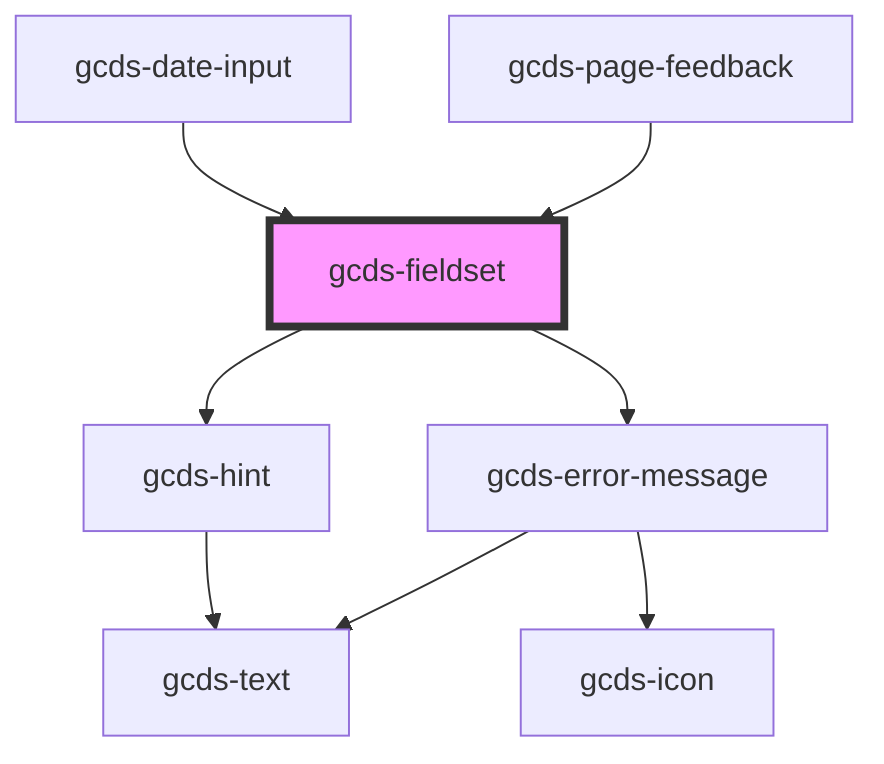

# gcds-fieldset

<!-- Auto Generated Below -->

## Properties

| Property                  | Attribute       | Description                                       | Type                                                | Default     |
| ------------------------- | --------------- | ------------------------------------------------- | --------------------------------------------------- | ----------- |
| `disabled`                | `disabled`      | Flag to disable fieldset and its contents         | `boolean`                                           | `undefined` |
| `errorMessage`            | `error-message` | Error message for invalid form elements in group. | `string`                                            | `undefined` |
| `fieldsetId` _(required)_ | `fieldset-id`   | The unique identifier for the component           | `string`                                            | `undefined` |
| `hint`                    | `hint`          | Hint displayed below the legend.                  | `string`                                            | `undefined` |
| `legend` _(required)_     | `legend`        | The title for the contents of the fieldset        | `string`                                            | `undefined` |
| `required`                | `required`      | Flag the contents are required                    | `boolean`                                           | `undefined` |
| `validateOn`              | `validate-on`   | Set event to call validator                       | `"blur" \| "other" \| "submit"`                     | `undefined` |
| `validator`               | --              | Array of validators                               | `(string \| ValidatorEntry \| Validator<string>)[]` | `undefined` |

## Events

| Event                 | Description                                       | Type                  |
| --------------------- | ------------------------------------------------- | --------------------- |
| `gcdsError`           | Emitted when the fieldset has a validation error. | `CustomEvent<object>` |
| `gcdsGroupError`      | Emitted when the fieldset has a validation error. | `CustomEvent<string>` |
| `gcdsGroupErrorClear` | Emitted when the fieldset has a validation error. | `CustomEvent<void>`   |
| `gcdsValid`           | Emitted when the fieldset has a validation error. | `CustomEvent<object>` |

## Methods

### `validate() => Promise<void>`

Call any active validators

#### Returns

Type: `Promise<void>`

## Dependencies

### Used by

 - [gcds-date-input](../gcds-date-input)
 - [gcds-page-feedback](../gcds-page-feedback)

### Depends on

- [gcds-hint](../gcds-hint)
- [gcds-error-message](../gcds-error-message)

### Graph

----------------------------------------------

*Built with [StencilJS](https://stenciljs.com/)*
