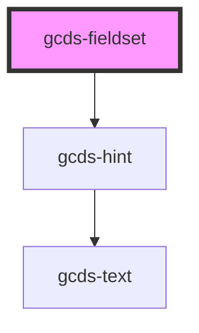

# gcds-fieldset

<!-- Auto Generated Below -->

## Properties

| Property                  | Attribute     | Description                                             | Type                                   | Default     |
| ------------------------- | ------------- | ------------------------------------------------------- | -------------------------------------- | ----------- |
| `fieldsetId` _(required)_ | `fieldset-id` | The unique identifier for the component                 | `string`                               | `undefined` |
| `hint`                    | `hint`        | Hint displayed below the legend.                        | `string`                               | `undefined` |
| `legend` _(required)_     | `legend`      | The title for the contents of the fieldset              | `string`                               | `undefined` |
| `legendSize` _(required)_ | `legend-size` | Sets the appropriate font size for the fieldset legend. | `"h2" \| "h3" \| "h4" \| "h5" \| "h6"` | `undefined` |

## Dependencies

### Depends on

- [gcds-hint](../gcds-hint)

### Graph

----------------------------------------------

*Built with [StencilJS](https://stenciljs.com/)*
