# gcds-file-uploader

<!-- Auto Generated Below -->

## Overview

A file uploader is a space to select and add supporting documentation.

## Properties

| Property                  | Attribute       | Description                                                                                                                     | Type                                                                      | Default     |
| ------------------------- | --------------- | ------------------------------------------------------------------------------------------------------------------------------- | ------------------------------------------------------------------------- | ----------- |
| `accept`                  | `accept`        | Defines the file types the file uploader accepts.                                                                               | `string`                                                                  | `undefined` |
| `autofocus`               | `autofocus`     | If true, the file uploader will be focused on component render                                                                  | `boolean`                                                                 | `undefined` |
| `disabled`                | `disabled`      | Specifies if a file uploader element is disabled or not.                                                                        | `boolean`                                                                 | `false`     |
| `errorMessage`            | `error-message` | Error message for an invalid file uploader element.                                                                             | `string`                                                                  | `undefined` |
| `files`                   | `files`         | FileList of uploaded files to input                                                                                             | `FileList`                                                                | `undefined` |
| `form`                    | `form`          | The ID of the form that the file uploader field belongs to.                                                                     | `string`                                                                  | `undefined` |
| `hint`                    | `hint`          | Hint displayed below the label.                                                                                                 | `string`                                                                  | `undefined` |
| `label` _(required)_      | `label`         | Form field label.                                                                                                               | `string`                                                                  | `undefined` |
| `multiple`                | `multiple`      | Boolean that specifies if the user is allowed to select more than one file.                                                     | `boolean`                                                                 | `undefined` |
| `name` _(required)_       | `name`          | Name attribute for file input element.                                                                                          | `string`                                                                  | `undefined` |
| `required`                | `required`      | Specifies if a form field is required or not.                                                                                   | `boolean`                                                                 | `false`     |
| `uploaderId` _(required)_ | `uploader-id`   | Id attribute for a file uploader element.                                                                                       | `string`                                                                  | `undefined` |
| `validateOn`              | `validate-on`   | Set event to call validator                                                                                                     | `"blur" \| "other" \| "submit"`                                           | `'blur'`    |
| `validator`               | `validator`     | Array of validators                                                                                                             | `(string \| ValidatorEntry \| Validator<string \| number \| FileList>)[]` | `undefined` |
| `validity`                | `validity`      | Read-only property of the file uploader, returns a ValidityState object that represents the validity states this element is in. | `ValidityState`                                                           | `undefined` |
| `value`                   | `value`         | Value for a file uploader element.                                                                                              | `string[]`                                                                | `[]`        |

## Events

| Event            | Description                                                                                  | Type                    |
| ---------------- | -------------------------------------------------------------------------------------------- | ----------------------- |
| `gcdsBlur`       | Emitted when the uploader loses focus.                                                       | `CustomEvent<void>`     |
| `gcdsChange`     | Emitted when the user has made a file selection. Contains the new value in the event detail. | `CustomEvent<string[]>` |
| `gcdsError`      | Emitted when the uploader has a validation error.                                            | `CustomEvent<object>`   |
| `gcdsFocus`      | Emitted when the uploader has focus.                                                         | `CustomEvent<void>`     |
| `gcdsInput`      | Emitted when the user has uploaded a file. Contains the new value in the event detail.       | `CustomEvent<string[]>` |
| `gcdsRemoveFile` | Remove file and update value.                                                                | `CustomEvent<any>`      |
| `gcdsValid`      | Emitted when the uploader has a validation error.                                            | `CustomEvent<object>`   |

## Methods

### `checkValidity() => Promise<boolean>`

Check the validity of gcds-file-uploader

#### Returns

Type: `Promise<boolean>`

### `getValidationMessage() => Promise<string>`

Get validationMessage of gcds-file-uploader

#### Returns

Type: `Promise<string>`

### `validate() => Promise<void>`

Call any active validators

#### Returns

Type: `Promise<void>`

## Dependencies

### Depends on

- [gcds-label](../gcds-label)
- [gcds-hint](../gcds-hint)
- [gcds-error-message](../gcds-error-message)
- [gcds-sr-only](../gcds-sr-only)
- [gcds-text](../gcds-text)
- [gcds-icon](../gcds-icon)

### Graph

```mermaid
graph TD;
  gcds-file-uploader --> gcds-label
  gcds-file-uploader --> gcds-hint
  gcds-file-uploader --> gcds-error-message
  gcds-file-uploader --> gcds-sr-only
  gcds-file-uploader --> gcds-text
  gcds-file-uploader --> gcds-icon
  gcds-hint --> gcds-text
  gcds-error-message --> gcds-text
  gcds-error-message --> gcds-icon
  style gcds-file-uploader fill:#26374a,stroke:#333,stroke-width:4px
```

----------------------------------------------

*Built with [StencilJS](https://stenciljs.com/)*
