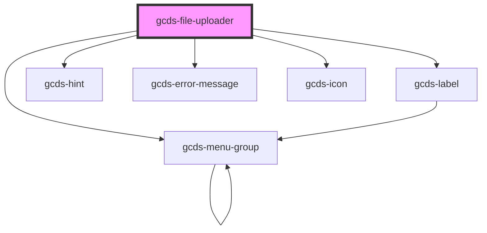

# gcds-file-uploader

<!-- Auto Generated Below -->

## Properties

| Property                  | Attribute       | Description                                                                 | Type                                                | Default     |
| ------------------------- | --------------- | --------------------------------------------------------------------------- | --------------------------------------------------- | ----------- |
| `accept`                  | `accept`        | Defines the file types the file uploader accepts.                           | `string`                                            | `undefined` |
| `blurHandler`             | --              | Custom callback function on blur event                                      | `Function`                                          | `undefined` |
| `changeHandler`           | --              | Custom callback function on change event                                    | `Function`                                          | `undefined` |
| `disabled`                | `disabled`      | Specifies if a file uploader element is disabled or not.                    | `boolean`                                           | `false`     |
| `errorMessage`            | `error-message` | Error message for an invalid file uploader element.                         | `string`                                            | `undefined` |
| `focusHandler`            | --              | Custom callback function on focus event                                     | `Function`                                          | `undefined` |
| `hint`                    | `hint`          | Hint displayed below the label.                                             | `string`                                            | `undefined` |
| `label` _(required)_      | `label`         | Form field label.                                                           | `string`                                            | `undefined` |
| `multiple`                | `multiple`      | Boolean that specifies if the user is allowed to select more than one file. | `boolean`                                           | `undefined` |
| `required`                | `required`      | Specifies if a form field is required or not.                               | `boolean`                                           | `false`     |
| `uploaderId` _(required)_ | `uploader-id`   | Id attribute for a file uploader element.                                   | `string`                                            | `undefined` |
| `validateOn`              | `validate-on`   | Set event to call validator                                                 | `"blur" \| "other" \| "submit"`                     | `undefined` |
| `validator`               | --              | Array of validators                                                         | `(string \| ValidatorEntry \| Validator<string>)[]` | `undefined` |
| `value`                   | --              | Value for a file uploader element.                                          | `string[]`                                          | `[]`        |

## Events

| Event                    | Description                                    | Type                  |
| ------------------------ | ---------------------------------------------- | --------------------- |
| `gcdsBlur`               | Emitted when the uploader loses focus.         | `CustomEvent<void>`   |
| `gcdsError`              | Emitted when the input has a validation error. | `CustomEvent<object>` |
| `gcdsFileUploaderChange` | Update value based on user selection.          | `CustomEvent<any>`    |
| `gcdsFocus`              | Emitted when the uploader has focus.           | `CustomEvent<void>`   |
| `gcdsRemoveFile`         | Remove file and update value.                  | `CustomEvent<any>`    |
| `gcdsValid`              | Emitted when the input has a validation error. | `CustomEvent<object>` |

## Methods

### `validate() => Promise<void>`

Call any active validators

#### Returns

Type: `Promise<void>`

## Dependencies

### Depends on

- [gcds-label](../gcds-label)
- [gcds-hint](../gcds-hint)
- [gcds-error-message](../gcds-error-message)
- [gcds-icon](../gcds-icon)
- [gcds-menu-group](../gcds-menu-group)

### Graph

----------------------------------------------

*Built with [StencilJS](https://stenciljs.com/)*
