# gcds-footer

<!-- Auto Generated Below -->

## Overview

The footer is the responsive Government of Canada branded footer landmark.

## Properties

| Property            | Attribute            | Description                                                                 | Type                  | Default     |
| ------------------- | -------------------- | --------------------------------------------------------------------------- | --------------------- | ----------- |
| `contextualHeading` | `contextual-heading` | Heading for contextual slot and nav landmark                                | `string`              | `undefined` |
| `contextualLinks`   | `contextual-links`   | Object of list items for contextual band. Format: { link-label: link-href } | `object \| string`    | `undefined` |
| `display`           | `display`            | Display mode of the footer                                                  | `"compact" \| "full"` | `'compact'` |
| `subLinks`          | `sub-links`          | Object of list items for sub-footer. Format: { link-label: link-href }      | `object \| string`    | `undefined` |

## Events

| Event       | Description                                                                    | Type                  |
| ----------- | ------------------------------------------------------------------------------ | --------------------- |
| `gcdsBlur`  | Emitted when the link loses focus.                                             | `CustomEvent<void>`   |
| `gcdsClick` | Emitted when the link has been clicked. Contains the href in the event detail. | `CustomEvent<string>` |
| `gcdsFocus` | Emitted when the link has focus.                                               | `CustomEvent<void>`   |

## Dependencies

### Depends on

- [gcds-signature](../gcds-signature)
- [gcds-sr-only](../gcds-sr-only)
- [gcds-link](../gcds-link)

### Graph

```mermaid
graph TD;
  gcds-footer --> gcds-signature
  gcds-footer --> gcds-sr-only
  gcds-footer --> gcds-link
  gcds-link --> gcds-icon
  style gcds-footer fill:#26374a,stroke:#333,stroke-width:4px
```

----------------------------------------------

*Built with [StencilJS](https://stenciljs.com/)*
