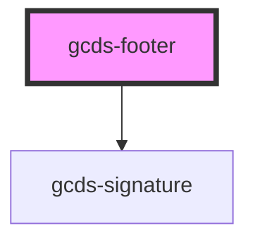

# gcds-footer

<!-- Auto Generated Below -->

## Properties

| Property          | Attribute          | Description                                                      | Type                  | Default     |
| ----------------- | ------------------ | ---------------------------------------------------------------- | --------------------- | ----------- |
| `display`         | `display`          | Display mode of the footer                                       | `"compact" \| "full"` | `undefined` |
| `topHref`         | `top-href`         | Top of page href                                                 | `string`              | `undefined` |
| `wordmarkVariant` | `wordmark-variant` | GcdsSignature - The variant of the Government of Canada wordmark | `"colour" \| "white"` | `undefined` |

## Dependencies

### Depends on

- [gcds-signature](../gcds-signature)

### Graph

----------------------------------------------

*Built with [StencilJS](https://stenciljs.com/)*
