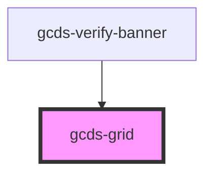

# gcds-grid

<!-- Auto Generated Below -->

## Properties

| Property         | Attribute         | Description                                                                                                                 | Type                                                                                                                                                                                      | Default     |
| ---------------- | ----------------- | --------------------------------------------------------------------------------------------------------------------------- | ----------------------------------------------------------------------------------------------------------------------------------------------------------------------------------------- | ----------- |
| `alignContent`   | `align-content`   | If total grid size is less than the size of its grid container, this property aligns the grid along the block (column) axis | `"center" \| "end" \| "space-around" \| "space-between" \| "space-evenly" \| "start" \| "stretch"`                                                                                        | `undefined` |
| `alignItems`     | `align-items`     | Aligns grid items along the block (column) axis                                                                             | `"baseline" \| "center" \| "end" \| "start" \| "stretch"`                                                                                                                                 | `undefined` |
| `columns`        | `columns`         | Defines the columns of the grid Option to set different layouts for desktop \| tablet \| default                            | `string`                                                                                                                                                                                  | `undefined` |
| `columnsDesktop` | `columns-desktop` |                                                                                                                             | `string`                                                                                                                                                                                  | `undefined` |
| `columnsTablet`  | `columns-tablet`  |                                                                                                                             | `string`                                                                                                                                                                                  | `undefined` |
| `container`      | `container`       | Defines grid container size                                                                                                 | `"fluid" \| "lg" \| "md" \| "sm" \| "xs"`                                                                                                                                                 | `'fluid'`   |
| `display`        | `display`         | Defines element as grid or inline-grid container                                                                            | `"grid" \| "inline-grid"`                                                                                                                                                                 | `'grid'`    |
| `gap`            | `gap`             | Shorthand for column-gap + row-gap Specifies the width of the gutters between columns and rows                              | `"spacing-100" \| "spacing-1000" \| "spacing-200" \| "spacing-300" \| "spacing-400" \| "spacing-50" \| "spacing-500" \| "spacing-600" \| "spacing-700" \| "spacing-800" \| "spacing-900"` | `undefined` |
| `justifyContent` | `justify-content` | If total grid size is less than the size of its grid container, this property aligns the grid along the inline (row) axis   | `"center" \| "end" \| "space-around" \| "space-between" \| "space-evenly" \| "start" \| "stretch"`                                                                                        | `undefined` |
| `justifyItems`   | `justify-items`   | Aligns grid items along the inline (row) axis                                                                               | `"center" \| "end" \| "start" \| "stretch"`                                                                                                                                               | `undefined` |
| `placeContent`   | `place-content`   | Sets both the align-content + justify-content properties                                                                    | `"center" \| "end" \| "space-around" \| "space-between" \| "space-evenly" \| "start" \| "stretch"`                                                                                        | `undefined` |
| `placeItems`     | `place-items`     | Sets both the align-items + justify-items properties                                                                        | `"center" \| "end" \| "start" \| "stretch"`                                                                                                                                               | `undefined` |
| `tag`            | `tag`             | Set tag for grid container                                                                                                  | `string`                                                                                                                                                                                  | `'div'`     |

## Dependencies

### Used by

 - [gcds-verify-banner](../gcds-verify-banner)

### Graph

----------------------------------------------

*Built with [StencilJS](https://stenciljs.com/)*
