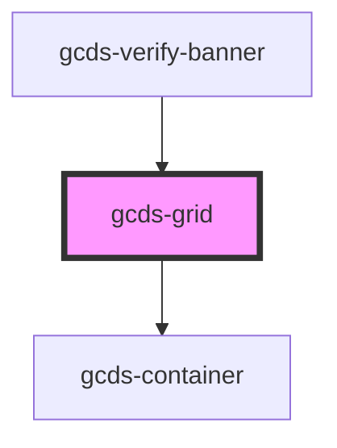

# gcds-grid

A grid is a responsive, flexible column layout to position elements on a page.

## Properties

| Property         | Attribute          | Description                                                                                                                                                                                                                             | Type                                                                                                                                           | Default     |
| ---------------- | ------------------ | --------------------------------------------------------------------------------------------------------------------------------------------------------------------------------------------------------------------------------------- | ---------------------------------------------------------------------------------------------------------------------------------------------- | ----------- |
| `alignContent`   | `align-content`    | If total grid size is less than the size of its grid container, this property aligns the grid along the block (column) axis                                                                                                             | `"center" \| "end" \| "space-around" \| "space-between" \| "space-evenly" \| "start" \| "stretch"`                                             | `undefined` |
| `alignItems`     | `align-items`      | Aligns grid items along the block (column) axis                                                                                                                                                                                         | `"baseline" \| "center" \| "end" \| "start" \| "stretch"`                                                                                      | `undefined` |
| `centered`       | `centered`         | Defines if grid container is centered or not                                                                                                                                                                                            | `boolean`                                                                                                                                      | `false`     |
| `columns`        | `columns`          | Defines the default number of grid columns for all viewports if columnsTablet and columnsDesktop are not defined. Option to set different layouts for desktop with columnsDesktop and for tablet with columnsTablet.                    | `string`                                                                                                                                       | `undefined` |
| `columnsDesktop` | `columns-desktop`  | Provides option to set a different number of grid columns for desktop screens.                                                                                                                                                          | `string`                                                                                                                                       | `undefined` |
| `columnsTablet`  | `columns-tablet`   | Provides option to set a different number of grid columns for tablet screens. If columnsDesktop is not defined, columnsTablet will be used to define the number of columns for desktop as well.                                         | `string`                                                                                                                                       | `undefined` |
| `container`      | `container`        | Defines grid container size                                                                                                                                                                                                             | `"full" \| "lg" \| "md" \| "sm" \| "xl" \| "xs"`                                                                                               | `undefined` |
| `display`        | `display`          | Defines element as grid or inline-grid container                                                                                                                                                                                        | `"grid" \| "inline-grid"`                                                                                                                      | `'grid'`    |
| `equalRowHeight` | `equal-row-height` | Sets all grid items to have an equal height, based on the tallest item.                                                                                                                                                                 | `boolean`                                                                                                                                      | `false`     |
| `gap`            | `gap`              | Defines the horizontal and vertical spacing between items in a grid container for all viewports if gapTablet and gapDesktop are not defined. Option to set different spacing for desktop with gapDesktop and for tablet with gapTablet. | `"150" \| "175" \| "200" \| "225" \| "250" \| "300" \| "350" \| "400" \| "450" \| "500" \| "550" \| "600" \| "650" \| "700" \| "750" \| "800"` | `'300'`     |
| `gapDesktop`     | `gap-desktop`      | Provides option to set horizontal and vertical spacing between items in a grid container for desktop screens.                                                                                                                           | `"150" \| "175" \| "200" \| "225" \| "250" \| "300" \| "350" \| "400" \| "450" \| "500" \| "550" \| "600" \| "650" \| "700" \| "750" \| "800"` | `undefined` |
| `gapTablet`      | `gap-tablet`       | Provides option to set horizontal and vertical spacing between items in a grid container for tablet screens. If gapDesktop is not defined, gapTablet will be used to define the spacing for desktop screens as well.                    | `"150" \| "175" \| "200" \| "225" \| "250" \| "300" \| "350" \| "400" \| "450" \| "500" \| "550" \| "600" \| "650" \| "700" \| "750" \| "800"` | `undefined` |
| `justifyContent` | `justify-content`  | If total grid size is less than the size of its grid container, this property aligns the grid along the inline (row) axis                                                                                                               | `"center" \| "end" \| "space-around" \| "space-between" \| "space-evenly" \| "start" \| "stretch"`                                             | `undefined` |
| `justifyItems`   | `justify-items`    | Aligns grid items along the inline (row) axis                                                                                                                                                                                           | `"center" \| "end" \| "start" \| "stretch"`                                                                                                    | `undefined` |
| `placeContent`   | `place-content`    | Sets both the align-content + justify-content properties                                                                                                                                                                                | `"center" \| "end" \| "space-around" \| "space-between" \| "space-evenly" \| "start" \| "stretch"`                                             | `undefined` |
| `placeItems`     | `place-items`      | Sets both the align-items + justify-items properties                                                                                                                                                                                    | `"center" \| "end" \| "start" \| "stretch"`                                                                                                    | `undefined` |
| `tag`            | `tag`              | Set tag for grid container                                                                                                                                                                                                              | `"article" \| "aside" \| "div" \| "dl" \| "main" \| "nav" \| "ol" \| "section" \| "ul"`                                                        | `'div'`     |

## Dependencies

### Used by

- [gcds-verify-banner](../gcds-verify-banner)

### Depends on

- [gcds-container](../gcds-container)

### Graph

----------------------------------------------

## gcds-grid-col

Grid columns define their own size. Each grid column can define a base, tablet (optional) and desktop (optional) size.

### Properties

| Property  | Attribute | Description                                                                                                                                                                           | Type                                                          | Default     |
| --------- | --------- | ------------------------------------------------------------------------------------------------------------------------------------------------------------------------------------- | ------------------------------------------------------------- | ----------- |
| `desktop` | `desktop` | Optimize grid column size for desktop (1024px and above). Desktop grid column sizes are based on a 12 column grid.                                                                    | `1 \| 10 \| 11 \| 12 \| 2 \| 3 \| 4 \| 5 \| 6 \| 7 \| 8 \| 9` | `undefined` |
| `tablet`  | `tablet`  | Optimize grid column size for tablet (768px - 1023px). Tablet grid column sizes are based on a 6 column grid. The tablet size will also be used for desktop, if desktop is undefined. | `1 \| 2 \| 3 \| 4 \| 5 \| 6`                                  | `6`         |
| `tag`     | `tag`     | Set tag for grid column                                                                                                                                                               | `string`                                                      | `'div'`     |

----------------------------------------------

*Built with [StencilJS](https://stenciljs.com/)*