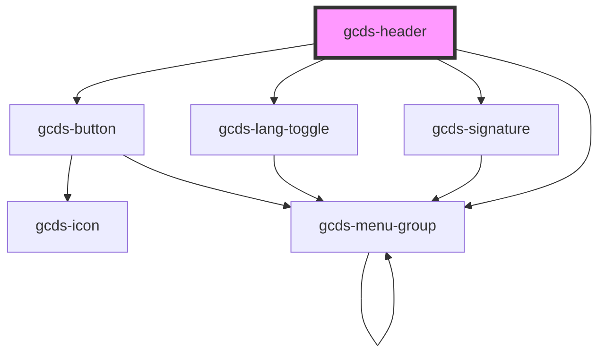

# gcds-header

<!-- Auto Generated Below -->

## Properties

| Property                  | Attribute            | Description                                                                         | Type                  | Default     |
| ------------------------- | -------------------- | ----------------------------------------------------------------------------------- | --------------------- | ----------- |
| `langHref` _(required)_   | `lang-href`          | GcdsLangToggle - The href attribute specifies the URL of the opposite language page | `string`              | `undefined` |
| `signatureHasLink`        | `signature-has-link` | GcdsSignature - GCDS signature links to Canada.ca                                   | `boolean`             | `true`      |
| `signatureVariant`        | `signature-variant`  | GcdsSignature - The variant of the Government of Canada signature                   | `"colour" \| "white"` | `undefined` |
| `skipToHref` _(required)_ | `skip-to-href`       | Top navigation - Skip to content href                                               | `string`              | `undefined` |

## Dependencies

### Depends on

- [gcds-button](../gcds-button)
- [gcds-lang-toggle](../gcds-lang-toggle)
- [gcds-signature](../gcds-signature)
- [gcds-menu-group](../gcds-menu-group)

### Graph

----------------------------------------------

*Built with [StencilJS](https://stenciljs.com/)*
