# gcds-header

<!-- Auto Generated Below -->

## Overview

The header is the responsive Government of Canada branded header landmark.

## Properties

| Property                  | Attribute            | Description                                                                         | Type      | Default     |
| ------------------------- | -------------------- | ----------------------------------------------------------------------------------- | --------- | ----------- |
| `langHref` _(required)_   | `lang-href`          | GcdsLangToggle - The href attribute specifies the URL of the opposite language page | `string`  | `undefined` |
| `signatureHasLink`        | `signature-has-link` | GcdsSignature - GCDS signature links to Canada.ca                                   | `boolean` | `true`      |
| `skipToHref` _(required)_ | `skip-to-href`       | Top navigation - Skip to content href                                               | `string`  | `undefined` |

## Events

| Event       | Description                                                                    | Type                  |
| ----------- | ------------------------------------------------------------------------------ | --------------------- |
| `gcdsBlur`  | Emitted when the link loses focus.                                             | `CustomEvent<void>`   |
| `gcdsClick` | Emitted when the link has been clicked. Contains the href in the event detail. | `CustomEvent<string>` |
| `gcdsFocus` | Emitted when the link has focus.                                               | `CustomEvent<void>`   |

## Slots

| Slot            | Description                                                               |
| --------------- | ------------------------------------------------------------------------- |
| `"banner"`      | Slot to add a banner across the top of the header.                        |
| `"breadcrumb"`  | Slot to add breadcrumbs at the bottom of the header.                      |
| `"menu"`        | Slot to add a menu below the divider line.                                |
| `"search"`      | Slot to add a search field to the right of the header.                    |
| `"signature"`   | Slot to replace Government of Canada signature.                           |
| `"skip-to-nav"` | Slot to add a hidden skip to content navigation at the top of the header. |
| `"toggle"`      | Slot to add a custom language toggle in the top-right of the header.      |

## Dependencies

### Depends on

- [gcds-link](../gcds-link)
- [gcds-lang-toggle](../gcds-lang-toggle)
- [gcds-signature](../gcds-signature)

### Graph

```mermaid
graph TD;
  gcds-header --> gcds-link
  gcds-header --> gcds-lang-toggle
  gcds-header --> gcds-signature
  gcds-link --> gcds-icon
  gcds-lang-toggle --> gcds-sr-only
  gcds-lang-toggle --> gcds-link
  gcds-signature --> gcds-sr-only
  style gcds-header fill:#26374a,stroke:#333,stroke-width:4px
```

----------------------------------------------

*Built with [StencilJS](https://stenciljs.com/)*
