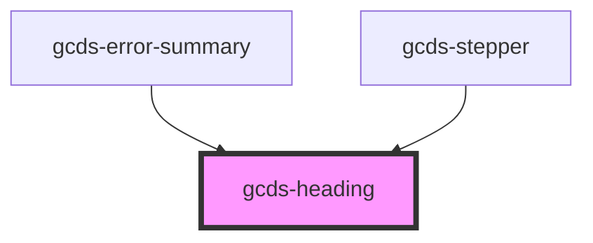

# gcds-heading

<!-- Auto Generated Below -->

## Properties

| Property           | Attribute         | Description                                                                                                                                | Type                                                                                                                                         | Default     |
| ------------------ | ----------------- | ------------------------------------------------------------------------------------------------------------------------------------------ | -------------------------------------------------------------------------------------------------------------------------------------------- | ----------- |
| `characterLimit`   | `character-limit` | Sets the line length to a maximum amount of characters per line for each heading level, ensuring a comfortable, accessible reading length. | `boolean`                                                                                                                                    | `true`      |
| `marginBottom`     | `margin-bottom`   | Adds margin below the heading. The default margin-botttom is 400.                                                                          | `"0" \| "100" \| "1000" \| "150" \| "200" \| "250" \| "300" \| "400" \| "450" \| "50" \| "500" \| "550" \| "600" \| "700" \| "800" \| "900"` | `'400'`     |
| `marginTop`        | `margin-top`      | Adds margin above the heading. The default margin-top for h1 is set to 0, while for h2 to h6 headings, it's 500.                           | `"0" \| "100" \| "1000" \| "150" \| "200" \| "250" \| "300" \| "400" \| "450" \| "50" \| "500" \| "550" \| "600" \| "700" \| "800" \| "900"` | `undefined` |
| `tag` _(required)_ | `tag`             | Sets the appropriate HTML tag for the selected level.                                                                                      | `"h1" \| "h2" \| "h3" \| "h4" \| "h5" \| "h6"`                                                                                               | `undefined` |

## Dependencies

### Used by

 - [gcds-error-summary](../gcds-error-summary)
 - [gcds-stepper](../gcds-stepper)

### Graph

----------------------------------------------

*Built with [StencilJS](https://stenciljs.com/)*
