# gcds-heading

<!-- Auto Generated Below -->

## Properties

| Property           | Attribute         | Description                                                                                                                                | Type                                                                                                                                                                                                                                                                                   | Default     |
| ------------------ | ----------------- | ------------------------------------------------------------------------------------------------------------------------------------------ | -------------------------------------------------------------------------------------------------------------------------------------------------------------------------------------------------------------------------------------------------------------------------------------- | ----------- |
| `characterLimit`   | `character-limit` | Sets the line length to a maximum amount of characters per line for each heading level, ensuring a comfortable, accessible reading length. | `boolean`                                                                                                                                                                                                                                                                              | `true`      |
| `marginBottom`     | `margin-bottom`   | Adds margin below the heading. The default margin-botttom is 300.                                                                          | `"0" \| "25" \| "50" \| "75" \| "100" \| "125" \| "150" \| "175" \| "200" \| "225" \| "250" \| "300" \| "350" \| "400" \| "450" \| "500" \| "550" \| "600" \| "650" \| "700" \| "750" \| "800" \| "850" \| "900" \| "950" \| "1000" \| "1050" \| "1100" \| "1150" \| "1200" \| "1250"` | `'300'`     |
| `marginTop`        | `margin-top`      | Adds margin above the heading. The default margin-top for h1 is set to 0, while for h2 to h6 headings, it's 600.                           | `"0" \| "25" \| "50" \| "75" \| "100" \| "125" \| "150" \| "175" \| "200" \| "225" \| "250" \| "300" \| "350" \| "400" \| "450" \| "500" \| "550" \| "600" \| "650" \| "700" \| "750" \| "800" \| "850" \| "900" \| "950" \| "1000" \| "1050" \| "1100" \| "1150" \| "1200" \| "1250"` | `undefined` |
| `tag` _(required)_ | `tag`             | Sets the appropriate HTML tag for the selected level.                                                                                      | `"h1" \| "h2" \| "h3" \| "h4" \| "h5" \| "h6"`                                                                                                                                                                                                                                         | `undefined` |

## Slots

| Slot | Description                  |
| ---- | ---------------------------- |
|      | Slot for the heading content |

## Dependencies

### Used by

 - [gcds-error-summary](../gcds-error-summary)
 - [gcds-notice](../gcds-notice)
 - [gcds-stepper](../gcds-stepper)

### Graph

```mermaid
graph TD;
  gcds-error-summary --> gcds-heading
  gcds-notice --> gcds-heading
  gcds-stepper --> gcds-heading
  style gcds-heading fill:#26374a,stroke:#333,stroke-width:4px
```

----------------------------------------------

*Built with [StencilJS](https://stenciljs.com/)*
