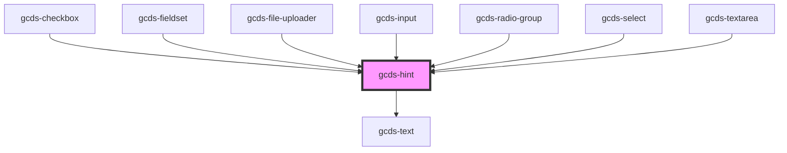

# gcds-hint

<!-- Auto Generated Below -->

## Properties

| Property | Attribute | Description                | Type     | Default     |
| -------- | --------- | -------------------------- | -------- | ----------- |
| `hintId` | `hint-id` | Id attribute for the hint. | `string` | `undefined` |

## Shadow Parts

| Part     | Description |
| -------- | ----------- |
| `"hint"` |             |

## Dependencies

### Used by

 - [gcds-checkbox](../gcds-checkbox)
 - [gcds-fieldset](../gcds-fieldset)
 - [gcds-file-uploader](../gcds-file-uploader)
 - [gcds-input](../gcds-input)
 - [gcds-radio-group](../gcds-radio-group)
 - [gcds-select](../gcds-select)
 - [gcds-textarea](../gcds-textarea)

### Depends on

- [gcds-text](../gcds-text)

### Graph

----------------------------------------------

*Built with [StencilJS](https://stenciljs.com/)*
