# gcds-hint

<!-- Auto Generated Below -->

## Properties

| Property | Attribute | Description                | Type     | Default     |
| -------- | --------- | -------------------------- | -------- | ----------- |
| `hintId` | `hint-id` | Id attribute for the hint. | `string` | `undefined` |

## Slots

| Slot | Description                |
| ---- | -------------------------- |
|      | Slot for the hint content. |

## Shadow Parts

| Part     | Description |
| -------- | ----------- |
| `"hint"` |             |

## Dependencies

### Used by

 - [gcds-checkboxes](../gcds-checkboxes)
 - [gcds-date-input](../gcds-date-input)
 - [gcds-fieldset](../gcds-fieldset)
 - [gcds-file-uploader](../gcds-file-uploader)
 - [gcds-input](../gcds-input)
 - [gcds-radios](../gcds-radios)
 - [gcds-select](../gcds-select)
 - [gcds-textarea](../gcds-textarea)

### Depends on

- [gcds-text](../gcds-text)

### Graph

```mermaid
graph TD;
  gcds-hint --> gcds-text
  gcds-checkboxes --> gcds-hint
  gcds-date-input --> gcds-hint
  gcds-fieldset --> gcds-hint
  gcds-file-uploader --> gcds-hint
  gcds-input --> gcds-hint
  gcds-radios --> gcds-hint
  gcds-select --> gcds-hint
  gcds-textarea --> gcds-hint
  style gcds-hint fill:#26374a,stroke:#333,stroke-width:4px
```

----------------------------------------------

*Built with [StencilJS](https://stenciljs.com/)*
