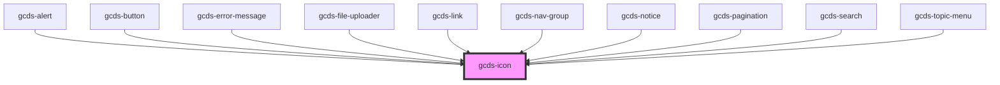

# gcds-icon

<!-- Auto Generated Below -->

## Properties

| Property            | Attribute      | Description                         | Type                                                                                                                                                                                                                                                                                   | Default     |
| ------------------- | -------------- | ----------------------------------- | -------------------------------------------------------------------------------------------------------------------------------------------------------------------------------------------------------------------------------------------------------------------------------------- | ----------- |
| `label`             | `label`        | Add icon description.               | `string`                                                                                                                                                                                                                                                                               | `undefined` |
| `marginLeft`        | `margin-left`  | Add margin to the left of the icon  | `"0" \| "25" \| "50" \| "75" \| "100" \| "125" \| "150" \| "175" \| "200" \| "225" \| "250" \| "300" \| "350" \| "400" \| "450" \| "500" \| "550" \| "600" \| "650" \| "700" \| "750" \| "800" \| "850" \| "900" \| "950" \| "1000" \| "1050" \| "1100" \| "1150" \| "1200" \| "1250"` | `undefined` |
| `marginRight`       | `margin-right` | Add margin to the right of the icon | `"0" \| "25" \| "50" \| "75" \| "100" \| "125" \| "150" \| "175" \| "200" \| "225" \| "250" \| "300" \| "350" \| "400" \| "450" \| "500" \| "550" \| "600" \| "650" \| "700" \| "750" \| "800" \| "850" \| "900" \| "950" \| "1000" \| "1050" \| "1100" \| "1150" \| "1200" \| "1250"` | `undefined` |
| `name` _(required)_ | `name`         | Name of the icon.                   | `"checkmark-circle" \| "chevron-down" \| "chevron-left" \| "chevron-right" \| "chevron-up" \| "close" \| "download" \| "email" \| "exclamation-circle" \| "external" \| "info-circle" \| "phone" \| "search" \| "warning-triangle"`                                                    | `undefined` |
| `size`              | `size`         | Defines the size of the icon.       | `"h1" \| "h2" \| "h3" \| "h4" \| "h5" \| "h6" \| "inherit" \| "text" \| "text-small"`                                                                                                                                                                                                  | `'inherit'` |

## Dependencies

### Used by

 - [gcds-alert](../gcds-alert)
 - [gcds-button](../gcds-button)
 - [gcds-error-message](../gcds-error-message)
 - [gcds-file-uploader](../gcds-file-uploader)
 - [gcds-link](../gcds-link)
 - [gcds-nav-group](../gcds-nav-group)
 - [gcds-notice](../gcds-notice)
 - [gcds-pagination](../gcds-pagination)
 - [gcds-search](../gcds-search)
 - [gcds-topic-menu](../gcds-topic-menu)

### Graph

----------------------------------------------

*Built with [StencilJS](https://stenciljs.com/)*
