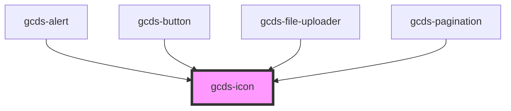

# gcds-icon

<!-- Auto Generated Below -->

## Properties

| Property            | Attribute      | Description                         | Type                                                                                                                                         | Default     |
| ------------------- | -------------- | ----------------------------------- | -------------------------------------------------------------------------------------------------------------------------------------------- | ----------- |
| `label`             | `label`        | Add icon description.               | `string`                                                                                                                                     | `undefined` |
| `marginLeft`        | `margin-left`  | Add margin to the left of the icon  | `"0" \| "100" \| "1000" \| "150" \| "200" \| "250" \| "300" \| "400" \| "450" \| "50" \| "500" \| "550" \| "600" \| "700" \| "800" \| "900"` | `undefined` |
| `marginRight`       | `margin-right` | Add margin to the right of the icon | `"0" \| "100" \| "1000" \| "150" \| "200" \| "250" \| "300" \| "400" \| "450" \| "50" \| "500" \| "550" \| "600" \| "700" \| "800" \| "900"` | `undefined` |
| `name` _(required)_ | `name`         | Name of the icon.                   | `string`                                                                                                                                     | `undefined` |
| `size`              | `size`         | Defines the size of the icon.       | `"inherit" \| "lg" \| "md" \| "sm" \| "xl" \| "xs"`                                                                                          | `'inherit'` |

## Dependencies

### Used by

 - [gcds-alert](../gcds-alert)
 - [gcds-button](../gcds-button)
 - [gcds-file-uploader](../gcds-file-uploader)
 - [gcds-pagination](../gcds-pagination)

### Graph

----------------------------------------------

*Built with [StencilJS](https://stenciljs.com/)*
