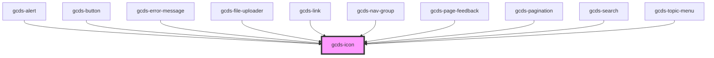

# gcds-icon

<!-- Auto Generated Below -->

## Properties

| Property            | Attribute      | Description                                                                         | Type                                                                                                                                         | Default     |
| ------------------- | -------------- | ----------------------------------------------------------------------------------- | -------------------------------------------------------------------------------------------------------------------------------------------- | ----------- |
| `fixedWidth`        | `fixed-width`  | If the icon should render as a fixed-width square, or their natural width.          | `boolean`                                                                                                                                    | `false`     |
| `iconStyle`         | `icon-style`   | Style of the icon. 'regular' icons are outlined. Some icons have 'solid' variation. | `"regular" \| "solid"`                                                                                                                       | `'solid'`   |
| `label`             | `label`        | Add icon description.                                                               | `string`                                                                                                                                     | `undefined` |
| `marginLeft`        | `margin-left`  | Add margin to the left of the icon                                                  | `"0" \| "100" \| "1000" \| "150" \| "200" \| "250" \| "300" \| "400" \| "450" \| "50" \| "500" \| "550" \| "600" \| "700" \| "800" \| "900"` | `undefined` |
| `marginRight`       | `margin-right` | Add margin to the right of the icon                                                 | `"0" \| "100" \| "1000" \| "150" \| "200" \| "250" \| "300" \| "400" \| "450" \| "50" \| "500" \| "550" \| "600" \| "700" \| "800" \| "900"` | `undefined` |
| `name` _(required)_ | `name`         | Name of the icon.                                                                   | `string`                                                                                                                                     | `undefined` |
| `size`              | `size`         | Defines the size of the icon.                                                       | `"caption" \| "h1" \| "h2" \| "h3" \| "h4" \| "h5" \| "h6" \| "inherit" \| "text"`                                                           | `'text'`    |

## Dependencies

### Used by

 - [gcds-alert](../gcds-alert)
 - [gcds-button](../gcds-button)
 - [gcds-error-message](../gcds-error-message)
 - [gcds-file-uploader](../gcds-file-uploader)
 - [gcds-link](../gcds-link)
 - [gcds-nav-group](../gcds-nav-group)
 - [gcds-page-feedback](../gcds-page-feedback)
 - [gcds-pagination](../gcds-pagination)
 - [gcds-search](../gcds-search)
 - [gcds-topic-menu](../gcds-topic-menu)

### Graph

----------------------------------------------

*Built with [StencilJS](https://stenciljs.com/)*
