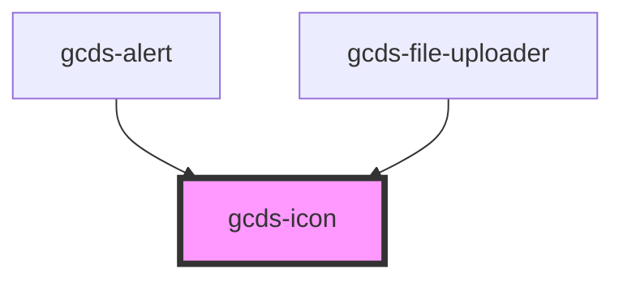

# gcds-icon

<!-- Auto Generated Below -->

## Properties

| Property            | Attribute      | Description                         | Type                                                                                                                                                                                      | Default     |
| ------------------- | -------------- | ----------------------------------- | ----------------------------------------------------------------------------------------------------------------------------------------------------------------------------------------- | ----------- |
| `label`             | `label`        | Add icon description.               | `string`                                                                                                                                                                                  | `undefined` |
| `marginLeft`        | `margin-left`  | Add margin to the left of the icon  | `"spacing-100" \| "spacing-1000" \| "spacing-200" \| "spacing-300" \| "spacing-400" \| "spacing-50" \| "spacing-500" \| "spacing-600" \| "spacing-700" \| "spacing-800" \| "spacing-900"` | `undefined` |
| `marginRight`       | `margin-right` | Add margin to the right of the icon | `"spacing-100" \| "spacing-1000" \| "spacing-200" \| "spacing-300" \| "spacing-400" \| "spacing-50" \| "spacing-500" \| "spacing-600" \| "spacing-700" \| "spacing-800" \| "spacing-900"` | `undefined` |
| `name` _(required)_ | `name`         | Name of the icon.                   | `string`                                                                                                                                                                                  | `undefined` |
| `size`              | `size`         | Defines the size of the icon.       | `"inherit" \| "lg" \| "md" \| "sm" \| "xl" \| "xs"`                                                                                                                                       | `'inherit'` |

## Dependencies

### Used by

 - [gcds-alert](../gcds-alert)
 - [gcds-file-uploader](../gcds-file-uploader)

### Graph

----------------------------------------------

*Built with [StencilJS](https://stenciljs.com/)*
