# gcds-input

<!-- Auto Generated Below -->

## Overview

An input is a space to enter short-form information in response to a question or instruction.

## Properties

| Property               | Attribute       | Description                                                                                                                                                             | Type                                                                        | Default     |
| ---------------------- | --------------- | ----------------------------------------------------------------------------------------------------------------------------------------------------------------------- | --------------------------------------------------------------------------- | ----------- |
| `autocomplete`         | `autocomplete`  | String to have autocomplete enabled.                                                                                                                                    | `string`                                                                    | `undefined` |
| `autofocus`            | `autofocus`     | If true, the input will be focused on component render                                                                                                                  | `boolean`                                                                   | `undefined` |
| `disabled`             | `disabled`      | Specifies if an input element is disabled or not.                                                                                                                       | `boolean`                                                                   | `false`     |
| `errorMessage`         | `error-message` | Error message for an invalid input element.                                                                                                                             | `string`                                                                    | `undefined` |
| `form`                 | `form`          | The ID of the form that the input field belongs to.                                                                                                                     | `string`                                                                    | `undefined` |
| `hideLabel`            | `hide-label`    | Specifies if the label is hidden or not.                                                                                                                                | `boolean`                                                                   | `false`     |
| `hint`                 | `hint`          | Hint displayed below the label and above the input field.                                                                                                               | `string`                                                                    | `undefined` |
| `inputId` _(required)_ | `input-id`      | Id  attribute for an input element.                                                                                                                                     | `string`                                                                    | `undefined` |
| `label` _(required)_   | `label`         | Form field label                                                                                                                                                        | `string`                                                                    | `undefined` |
| `max`                  | `max`           | The maximum value that the input field can accept. Only applies to number input type.                                                                                   | `number \| string`                                                          | `undefined` |
| `maxlength`            | `maxlength`     | The maximum number of characters that the input field can accept.                                                                                                       | `number`                                                                    | `undefined` |
| `min`                  | `min`           | The minimum value that the input field can accept. Only applies to number input type.                                                                                   | `number \| string`                                                          | `undefined` |
| `minlength`            | `minlength`     | The minimum number of characters that the input field can accept.                                                                                                       | `number`                                                                    | `undefined` |
| `name` _(required)_    | `name`          | Name attribute for an input element.                                                                                                                                    | `string`                                                                    | `undefined` |
| `pattern`              | `pattern`       | Specifies a regular expression the form control's value should match. See: https://developer.mozilla.org/en-US/docs/Web/HTML/Attributes/pattern                         | `string`                                                                    | `undefined` |
| `readonly`             | `readonly`      | If true, the input field cannot be modified.                                                                                                                            | `boolean`                                                                   | `undefined` |
| `required`             | `required`      | Specifies if a form field is required or not.                                                                                                                           | `boolean`                                                                   | `false`     |
| `size`                 | `size`          | Size attribute for an input element to provide a visual indication of the expected text length to the user.                                                             | `number`                                                                    | `undefined` |
| `step`                 | `step`          | A number that specifies the granularity that the value must adhere to. Valid for number type. See: https://developer.mozilla.org/en-US/docs/Web/HTML/Element/input#step | `"any" \| number`                                                           | `undefined` |
| `type`                 | `type`          | Set Input types                                                                                                                                                         | `"email" \| "number" \| "password" \| "search" \| "tel" \| "text" \| "url"` | `'text'`    |
| `validateOn`           | `validate-on`   | Set event to call validator                                                                                                                                             | `"blur" \| "other" \| "submit"`                                             | `'blur'`    |
| `validator`            | `validator`     | Array of validators                                                                                                                                                     | `(string \| ValidatorEntry \| Validator<string>)[]`                         | `undefined` |
| `validity`             | `validity`      | Read-only property of the input, returns a ValidityState object that represents the validity states this element is in.                                                 | `ValidityState`                                                             | `undefined` |
| `value`                | `value`         | Default value for an input element.                                                                                                                                     | `string`                                                                    | `undefined` |

## Events

| Event        | Description                                    | Type                  |
| ------------ | ---------------------------------------------- | --------------------- |
| `gcdsBlur`   | Emitted when the input loses focus.            | `CustomEvent<void>`   |
| `gcdsChange` | Emitted when the input has changed.            | `CustomEvent<string>` |
| `gcdsError`  | Emitted when the input has a validation error. | `CustomEvent<object>` |
| `gcdsFocus`  | Emitted when the input has focus.              | `CustomEvent<void>`   |
| `gcdsInput`  | Emitted when the element has received input.   | `CustomEvent<string>` |
| `gcdsValid`  | Emitted when the input has a validation error. | `CustomEvent<object>` |

## Methods

### `checkValidity() => Promise<boolean>`

Check the validity of gcds-input

#### Returns

Type: `Promise<boolean>`

### `getValidationMessage() => Promise<string>`

Get validationMessage of gcds-input

#### Returns

Type: `Promise<string>`

### `validate() => Promise<void>`

Call any active validators

#### Returns

Type: `Promise<void>`

## Dependencies

### Used by

 - [gcds-date-input](../gcds-date-input)

### Depends on

- [gcds-label](../gcds-label)
- [gcds-hint](../gcds-hint)
- [gcds-error-message](../gcds-error-message)

### Graph

```mermaid
graph TD;
  gcds-input --> gcds-label
  gcds-input --> gcds-hint
  gcds-input --> gcds-error-message
  gcds-hint --> gcds-text
  gcds-error-message --> gcds-text
  gcds-error-message --> gcds-icon
  gcds-date-input --> gcds-input
  style gcds-input fill:#26374a,stroke:#333,stroke-width:4px
```

----------------------------------------------

*Built with [StencilJS](https://stenciljs.com/)*
