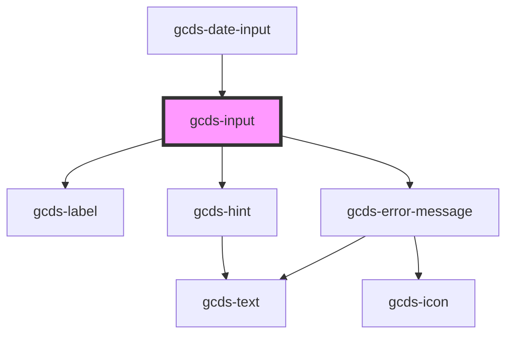

# gcds-input

<!-- Auto Generated Below -->

## Properties

| Property               | Attribute       | Description                                                      | Type                                                               | Default     |
| ---------------------- | --------------- | ---------------------------------------------------------------- | ------------------------------------------------------------------ | ----------- |
| `autocomplete`         | `autocomplete`  | String to have autocomplete enabled                              | `string`                                                           | `undefined` |
| `disabled`             | `disabled`      | Specifies if an input element is disabled or not.                | `boolean`                                                          | `false`     |
| `errorMessage`         | `error-message` | Error message for an invalid input element.                      | `string`                                                           | `undefined` |
| `hideLabel`            | `hide-label`    | Specifies if the label is hidden or not.                         | `boolean`                                                          | `false`     |
| `hint`                 | `hint`          | Hint displayed below the label and above the input field.        | `string`                                                           | `undefined` |
| `inputId` _(required)_ | `input-id`      | Id  attribute for an input element.                              | `string`                                                           | `undefined` |
| `label` _(required)_   | `label`         | Form field label                                                 | `string`                                                           | `undefined` |
| `name` _(required)_    | `name`          | Name attribute for an input element.                             | `string`                                                           | `undefined` |
| `required`             | `required`      | Specifies if a form field is required or not.                    | `boolean`                                                          | `false`     |
| `size`                 | `size`          | Size attribute for an input element. Defines max-length as well. | `number`                                                           | `undefined` |
| `type`                 | `type`          | Set Input types                                                  | `"email" \| "number" \| "password" \| "search" \| "text" \| "url"` | `'text'`    |
| `validateOn`           | `validate-on`   | Set event to call validator                                      | `"blur" \| "other" \| "submit"`                                    | `undefined` |
| `validator`            | --              | Array of validators                                              | `(string \| ValidatorEntry \| Validator<string>)[]`                | `undefined` |
| `value`                | `value`         | Default value for an input element.                              | `string`                                                           | `undefined` |

## Events

| Event        | Description                                    | Type                  |
| ------------ | ---------------------------------------------- | --------------------- |
| `gcdsBlur`   | Emitted when the input loses focus.            | `CustomEvent<void>`   |
| `gcdsChange` | Emitted when the input has changed.            | `CustomEvent<any>`    |
| `gcdsError`  | Emitted when the input has a validation error. | `CustomEvent<object>` |
| `gcdsFocus`  | Emitted when the input has focus.              | `CustomEvent<void>`   |
| `gcdsInput`  | Emitted when the element has received input.   | `CustomEvent<any>`    |
| `gcdsValid`  | Emitted when the input has a validation error. | `CustomEvent<object>` |

## Methods

### `validate() => Promise<void>`

Call any active validators

#### Returns

Type: `Promise<void>`

## Dependencies

### Used by

 - [gcds-date-input](../gcds-date-input)

### Depends on

- [gcds-label](../gcds-label)
- [gcds-hint](../gcds-hint)
- [gcds-error-message](../gcds-error-message)

### Graph

----------------------------------------------

*Built with [StencilJS](https://stenciljs.com/)*
