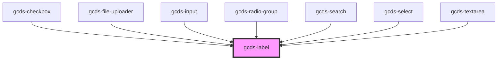

# gcds-label

<!-- Auto Generated Below -->

## Properties

| Property    | Attribute    | Description                                   | Type      | Default     |
| ----------- | ------------ | --------------------------------------------- | --------- | ----------- |
| `hideLabel` | `hide-label` | Specifies if the label is hidden or not.      | `boolean` | `undefined` |
| `label`     | `label`      | Form field label                              | `string`  | `undefined` |
| `labelFor`  | `label-for`  | Defines the label's for attribute.            | `string`  | `undefined` |
| `required`  | `required`   | Specifies if a form field is required or not. | `boolean` | `undefined` |

## Dependencies

### Used by

 - [gcds-checkbox](../gcds-checkbox)
 - [gcds-file-uploader](../gcds-file-uploader)
 - [gcds-input](../gcds-input)
 - [gcds-radio-group](../gcds-radio-group)
 - [gcds-search](../gcds-search)
 - [gcds-select](../gcds-select)
 - [gcds-textarea](../gcds-textarea)

### Graph

----------------------------------------------

*Built with [StencilJS](https://stenciljs.com/)*
