# gcds-lang-toggle

<!-- Auto Generated Below -->

## Properties

| Property            | Attribute | Description                                                        | Type     | Default     |
| ------------------- | --------- | ------------------------------------------------------------------ | -------- | ----------- |
| `href` _(required)_ | `href`    | The href attribute specifies the URL of the opposite language page | `string` | `undefined` |

## Events

| Event       | Description                                                                    | Type                  |
| ----------- | ------------------------------------------------------------------------------ | --------------------- |
| `gcdsBlur`  | Emitted when the link loses focus.                                             | `CustomEvent<void>`   |
| `gcdsClick` | Emitted when the link has been clicked. Contains the href in the event detail. | `CustomEvent<string>` |
| `gcdsFocus` | Emitted when the link has focus.                                               | `CustomEvent<void>`   |

## Dependencies

### Used by

 - [gcds-header](../gcds-header)

### Depends on

- [gcds-sr-only](../gcds-sr-only)
- [gcds-link](../gcds-link)

### Graph

```mermaid
graph TD;
  gcds-lang-toggle --> gcds-sr-only
  gcds-lang-toggle --> gcds-link
  gcds-link --> gcds-icon
  gcds-header --> gcds-lang-toggle
  style gcds-lang-toggle fill:#26374a,stroke:#333,stroke-width:4px
```

----------------------------------------------

*Built with [StencilJS](https://stenciljs.com/)*
